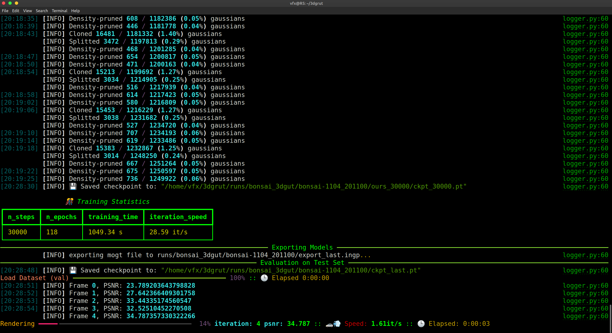
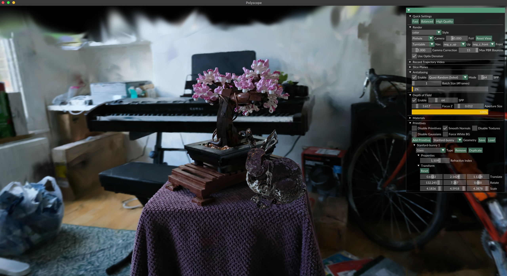

# Kartaverse Workflows | Gaussian Raytracing on Linux

If you are interested in volumetric rendering and 3DGS (3D Gaussian Splatting) technology, NVIDIA has released a 3D Gaussian Raytracing library for Linux that provides model training and interactive rendering support. The software is available from the [3DGRUT GitHub](https://github.com/nv-tlabs/3dgrut) repository with a permissive Apache 2.0 open-source license.

## Gaussian Raytracing Screenshots

3DGRUT Model Training:

3DGRUT Playground RealTime Viewport:

3DGRUT Screen Recording:

[Video](Images/NVIDIA_3dgrut_interactive_gaussian_raytracing.mp4 ':include :type=video controls width=100%')

## Setup the Conda environment on MintOS Linux

The following commands can be entered in a new terminal session to install Conda, create a new virtual environment, and install the NVIDIA 3DGRUT libraries:

	sudo apt-get update
	sudo apt install git
	
	wget --no-check-certificate https://repo.anaconda.com/miniconda/Miniconda3-py39_4.12.0-Linux-x86_64.sh
	chmod -v +x Miniconda*.sh
	./Miniconda3-py39_4.12.0-Linux-x86_64.sh
	
	conda create -y --name "Kartaverse" python==3.11 ipython
	conda activate Kartaverse
	
	cd $HOME
	git clone --recursive https://github.com/nv-tlabs/3dgrut.git
	cd 3dgrut
	chmod +x install_env.sh
	./install_env.sh Kartaverse
	
	conda install conda-forge::cuda-python	  
	pip install rich
	pip install hydra-core --upgrade
	pip install cupy

## Setup 3DGRUT Playground

After you have the NVIDIA 3DGRUT libraries installed, you can add the 3DGRUT interactive viewport called playground to your system:

	conda activate Kartaverse
	cd $HOME/3dgrut/
	pip install -r threedgrut_playground/requirements.txt

## Download the sample datasets:

	https://www.kaggle.com/datasets/nguyenhung1903/nerf-synthetic-dataset
	http://storage.googleapis.com/gresearch/refraw360/360_v2.zip
	https://storage.googleapis.com/gresearch/refraw360/360_extra_scenes.zip

## Download sample Wavefront OBJ models:

	https://github.com/alecjacobson/common-3d-test-models/

## Install the 3DGS benchmark datasets to:

	$HOME/3dgrut/data/

## Install Wavefront .obj formatted polygon 3D models to:

Playground allows you to add your own wavefront obj models to the 3D viewport. These models are rendered with a refractive glass shader.

	$HOME/3dgrut/threedgrut_playground/assets/

## Train a scene

Here is the syntax to train a 3D Gaussian Raytracing model. In this case we are using the classic "bonsai" reference scene:

	conda activate Kartaverse
	cd $HOME/3dgrut/
	python train.py --config-name apps/colmap_3dgut.yaml path=data/bonsai out_dir=runs experiment_name=bonsai_3dgut dataset.downsample_factor=2

The trained output is saved to the folder:

	$HOME/3dgrut/runs/bonsai_3dgut/

## View the pre-trained scene using Playground

Once a trained scene has been created, we can load this dataset into a Playground based realtime viewport session.

	conda activate Kartaverse
	cd $HOME/3dgrut/
	python playground.py --gs_object $HOME/3dgrut/runs/bonsai_3dgut/bonsai-1104_201100/ckpt_last.pt

