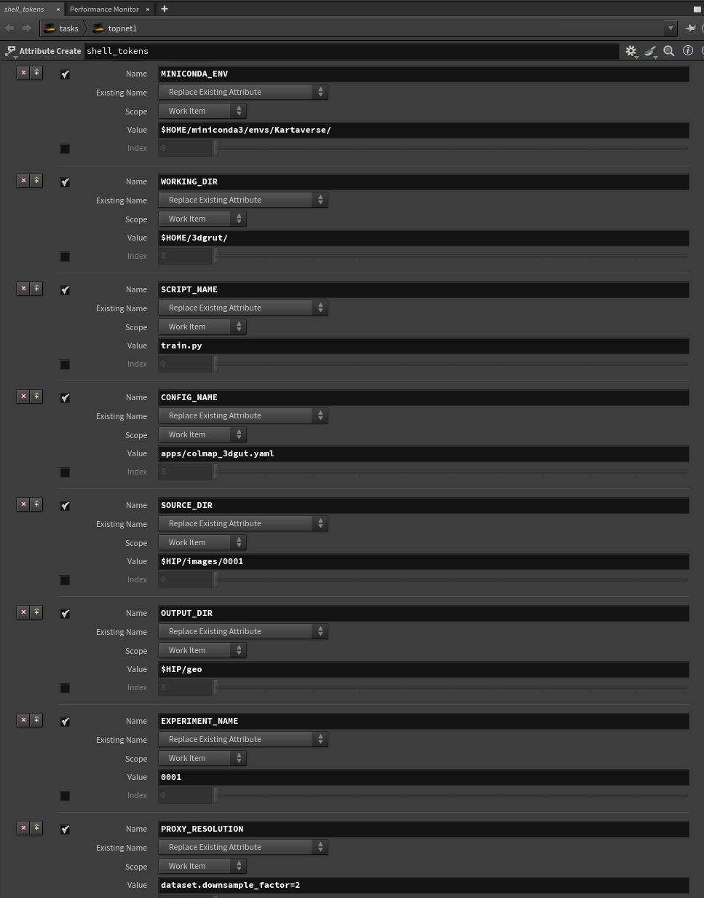
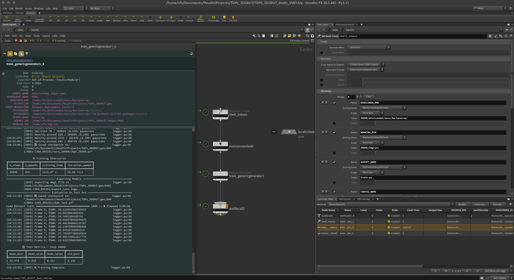

# Kartaverse Workflows | Gaussian Raytracing on Linux

If you are interested in volumetric rendering and 3DGS (3D Gaussian Splatting) technology, NVIDIA has released a 3D Gaussian Raytracing library for Linux that provides model training and interactive rendering support. The software is available from the [3DGRUT GitHub](https://github.com/nv-tlabs/3dgrut) repository with a permissive [Apache 2.0](https://github.com/nv-tlabs/3dgrut/blob/main/LICENSE) open-source license.

## Gaussian Raytracing Screenshots

3DGRUT Screen Recording:

[Video](Images/NVIDIA_3dgrut_interactive_gaussian_raytracing.mp4 ':include :type=video controls width=100%')

3DGRUT Model Training:

3DGRUT Playground RealTime Viewport:

## Setup the Conda environment on MintOS Linux

The following commands can be entered in a new terminal session to install Conda, create a new virtual environment, and install the NVIDIA 3DGRUT libraries:

	sudo apt-get update
	sudo apt install git
	
	wget --no-check-certificate https://repo.anaconda.com/miniconda/Miniconda3-py39_4.12.0-Linux-x86_64.sh
	chmod -v +x Miniconda*.sh
	./Miniconda3-py39_4.12.0-Linux-x86_64.sh
	
	conda create -y --name "Kartaverse" python==3.11 ipython
	conda activate Kartaverse
	
	cd $HOME
	git clone --recursive https://github.com/nv-tlabs/3dgrut.git
	cd 3dgrut
	chmod +x install_env.sh
	./install_env.sh Kartaverse
	
	conda install conda-forge::cuda-python	  
	pip install rich
	pip install hydra-core --upgrade
	pip install cupy

## Setup 3DGRUT Playground

After you have the NVIDIA 3DGRUT libraries installed, you can add the 3DGRUT interactive viewport called Playground to your system:

	conda activate Kartaverse
	cd $HOME/3dgrut/
	pip install -r threedgrut_playground/requirements.txt

## Download the sample datasets:

	https://www.kaggle.com/datasets/nguyenhung1903/nerf-synthetic-dataset
	http://storage.googleapis.com/gresearch/refraw360/360_v2.zip
	https://storage.googleapis.com/gresearch/refraw360/360_extra_scenes.zip

## Download sample Wavefront OBJ models:

	https://github.com/alecjacobson/common-3d-test-models/

## Install the 3DGS benchmark datasets to:

	$HOME/3dgrut/data/

## Install Wavefront .obj formatted polygon 3D models to:

Playground allows you to add your own wavefront obj models to the 3D viewport. These models are rendered with a refractive glass shader.

	$HOME/3dgrut/threedgrut_playground/assets/

## Train a scene

Here is the syntax to train a 3D Gaussian Raytracing model. In this case we are using the classic "bonsai" reference scene:

	conda activate Kartaverse
	cd $HOME/3dgrut/
	python train.py --config-name apps/colmap_3dgut.yaml path=data/bonsai out_dir=runs experiment_name=bonsai_3dgut dataset.downsample_factor=2

Decoding the above shell commands:

The "--config-name" entry allows you to specify a YAML file that is found in the folder "$HOME/3dgrut/config/apps/". There are 3dgrt and 3dgut presets that are optimized for colmap, nerf_synthetic, and scannetpp datasets.

The "path=" entry defines the relative path to the source folder where the image data and camera pose information is loaded from.

The "out_dir=" entry is the relative path to the folder where the model output is saved. Inside this folder is a sub-directory that is defined by the "experiment_name=" entry.

For example, if the "out_dir=runs" and "experiment_name=bonsai_3dgut" CLI parameters are used, then the trained output is saved to the folder:

	$HOME/3dgrut/runs/bonsai_3dgut/

If you run low on GPU VRAM the CLI flag "dataset.downsample_factor=2" should be able to help you tune the memory usage. This attribute lets you hop between the a COLMAP trained dataset's pre-computed "images_#" folders. These folders hold proxy pre-scaled resolution versions of your source footage. You can select which footage folder you want to use on a training task by adjusting the "dataset.downsample_factor=#" CLI parameter:

- specifying nothing uses the full resolution images in the "<colmap project>/images/" folder
- dataset.downsample_factor=2 uses the half resolution images in the "<colmap project>/images_2/" folder
- dataset.downsample_factor=4 uses the quarter resolution images in the  "<colmap project>/images_4/" folder
- dataset.downsample_factor=8 uses the eighth resolution images in the "<colmap project>/images_8/" folder

Example COLMAP project folder hierarchy:

    project/images/
    project/images_2/
    project/images_4/
    project/images_8/
    project/masks/
    project/project.ini
    project/database.db
    project/sparse/0/cameras.bin
    project/sparse/0/cameras.txt
    project/sparse/0/images.bin
    project/sparse/0/images.txt
    project/sparse/0/points3d.bin
    project/sparse/0/points3d.txt

## View the pre-trained scene using Playground

Once a trained scene has been created, we can load this dataset into a Playground based realtime viewport session.

	conda activate Kartaverse
	cd $HOME/3dgrut/
	python playground.py --gs_object $HOME/3dgrut/runs/bonsai_3dgut/bonsai-1104_201100/ckpt_last.pt

## 3DGRUT Command-Line Flags

If you want to start automating things with custom shell scripts it's handy to know what options exist in the 3DGRUT toolset.

### Train CLI Flags

The 3DGRUT Train CLI Parameters can be listed in the terminal using:

    conda activate Kartaverse
    cd $HOME/3dgrut/
    python train.py --help

The output is:

    usage: train.py [--help] [--hydra-help] [--version] [--cfg {job,hydra,all}] [--resolve] [--package PACKAGE] [--run]
                    [--multirun] [--shell-completion] [--config-path CONFIG_PATH] [--config-name CONFIG_NAME]
                    [--config-dir CONFIG_DIR] [--experimental-rerun EXPERIMENTAL_RERUN]
                    [--info [{all,config,defaults,defaults-tree,plugins,searchpath}]]
                    [overrides ...]
    
    python train.py --hydra-help
    Hydra (1.3.2)
    See https://hydra.cc for more info.
    
    == Flags ==
    --help,-h : Application's help
    --hydra-help : Hydra's help
    --version : Show Hydra's version and exit
    --cfg,-c : Show config instead of running [job|hydra|all]
    --resolve : Used in conjunction with --cfg, resolve config interpolations before printing.
    --package,-p : Config package to show
    --run,-r : Run a job
    --multirun,-m : Run multiple jobs with the configured launcher and sweeper
    --shell-completion,-sc : Install or Uninstall shell completion:
        Bash - Install:
        eval "$(python train.py -sc install=bash)"
        Bash - Uninstall:
        eval "$(python train.py -sc uninstall=bash)"
    
        Fish - Install:
        python train.py -sc install=fish | source
        Fish - Uninstall:
        python train.py -sc uninstall=fish | source
    
        Zsh - Install:
        Zsh is compatible with the Bash shell completion, see the [documentation](https://hydra.cc/docs/1.2/tutorials/basic/running_your_app/tab_completion#zsh-instructions) for details.
        eval "$(python train.py -sc install=bash)"
        Zsh - Uninstall:
        eval "$(python train.py -sc uninstall=bash)"
    
    --config-path,-cp : Overrides the config_path specified in hydra.main().
                        The config_path is absolute or relative to the Python file declaring @hydra.main()
    --config-name,-cn : Overrides the config_name specified in hydra.main()
    --config-dir,-cd : Adds an additional config dir to the config search path
    --experimental-rerun : Rerun a job from a previous config pickle
    --info,-i : Print Hydra information [all|config|defaults|defaults-tree|plugins|searchpath]
    Overrides : Any key=value arguments to override config values (use dots for.nested=overrides)
    
    == Configuration groups ==
    Compose your configuration from those groups (For example, append hydra/job_logging=disabled to command line)
    
    hydra: config
    hydra/env: default
    hydra/help: default
    hydra/hydra_help: default
    hydra/hydra_logging: default, disabled, hydra_debug, none
    hydra/job_logging: default, disabled, none, stdout
    hydra/launcher: basic
    hydra/output: default
    hydra/sweeper: basic
    
    
    Use '--cfg hydra' to Show the Hydra config.

### Playground CLI Flags

The 3DGRUT Playground CLI Parameters can be listed in the terminal using:

    conda activate Kartaverse
    cd $HOME/3dgrut/
    python playground.py --help

The output is:

    usage: playground.py [-h] --gs_object GS_OBJECT [--mesh_assets MESH_ASSETS] [--default_gs_config DEFAULT_GS_CONFIG]
                         [--buffer_mode {host2device,device2device}]
    
    options:
      -h, --help            show this help message and exit
      --gs_object GS_OBJECT
                            Path of pretrained 3dgrt checkpoint, as .pt / .ingp / .ply file.
      --mesh_assets MESH_ASSETS
                            Path to folder containing mesh assets of .obj or .glb format.
      --default_gs_config DEFAULT_GS_CONFIG
                            Name of default config to use for .ingp, .ply files, or .pt files not trained with 3dgrt.
      --buffer_mode {host2device,device2device}
                            Buffering mode for passing rendered data from CUDA to OpenGL screen buffer.Using device2device
                            is recommended.

## Houdini TOPs (Task Operator) Workflows

The next step is to hop into the deep end and explore 4D Gaussian Raytracing workflows. To do this we need to add a layer of workflow automation to the mix. We are going to do this with help of SideFX [Houdini TOPs](https://www.sidefx.com/docs/houdini/tops/index.html) (task operators) nodes. 

This approach makes it possible to create modular, reusable, node-graphs that control NVIDIA's 3DGRUT library using the command-line. The end goal is to create a fully templated system that can train a single static scene. The same nodes can be expanded to create a flexible 4D Gaussian Raytracing "video-grammetry" pipeline that can be run locally or in the cloud.

When using the 3DGRUT training system, it's possible to prepare your dataset and solve the camera pose using either [COLMAP](https://colmap.github.io/) (Free open-source), or a traditional photogrammetry program like [Metashape](https://www.agisoft.com/) or [Reality Capture](https://www.capturingreality.com/).

Note: When using COLMAP, it's worth highlighting the 3D Gaussian Raytracing "train.py" and Playgrounds toolsets are picky on the camera lens model used for the camera solve. At this time you cannot use the "SIMPLE_RADIAL" COLMAP camera model. This means you need to use undistorted datasets with a camera model like PINHOLE, SIMPLE_PINHOLE or OPENCV_FISHEYE.

### Examples

An example .hip file is provided to help you get started with 3DGRUT workflows in Houdini:

#### /HoudiniProjects/TOPS_3DGRUT/
- TOPS_3DGRUT_Static_V001.hip

This HIP file requires you to have launched Houdini/HQueue from inside a virtual environment session that has CUDA Toolkit, Python 3.11, and several other python packages pre-installed.

If you are using Miniconda, a new terminal session can be started up using:

    conda activate Kartaverse
    cd $HOME/3dgrut/
    houdini

### Parameter Customization

#### Attribute Create:

"MINICONDA_ENV" is the folder path where your active Anaconda Miniconda virtual environment exists. This is typically a location inside your current user account's home folder like "$HOME/miniconda3/envs/Kartaverse/".

"WORKING_DIR" is the folder path where the 3dgrut Github repo contents are saved locally. On a single-user workstation this is typically a folder like "$HOME/3dgrut/".

"SCRIPT_NAME" is the 3dgrut provided "train.py" script filename.

"CONFIG_NAME" is a relative  YAML filepath. It specifies a .yaml file that exists in a folder like "$HOME/3dgrut/config/apps/". This folder has 3dgrt and 3dgut presets that are optimized for colmap, nerf_synthetic, and scannetpp datasets.

"SOURCE_DIR" is where your multi-view camera array source images are located. This could be a path like "$HIP/images/0001". No trailing slash needed.

"OUTPUT_DIR" is the folder location where the training run output is saved. This could be a path with an environment variable included like "$HIP/geo". No trailing slash needed.

"EXPERIMENT_NAME" the name for the current project. This variable becomes the name for a sub-folder that is created with inside the OUTPUT_DIR folder. The trained model checkpoint file is saved inside this folder and it will typically have several other filename elements appended to the folder name when generated like "0001-1304_095251.

"PROXY_RESOLUTION" allows you to specify if a reduced resolution set of source images should be used. To work with the original images you can clear out this attribute's value field. If your training job is constantly running low on GPU VRAM, the CLI flag "dataset.downsample_factor=2" should be able to help you tune the memory usage. This attribute lets you hop between a COLMAP trained dataset's pre-computed "images_#" folders. These folders hold proxy pre-scaled resolution versions of all your source footage. You can select which footage folder you want to use on a training task by adjusting the "dataset.downsample_factor=#" CLI parameter:

    specifying nothing uses the full resolution images in the "/images/" folder
    dataset.downsample_factor=2 uses the half resolution images in the "/images_2/" folder
    dataset.downsample_factor=4 uses the quarter resolution images in the "/images_4/" folder
    dataset.downsample_factor=8 uses the eighth resolution images in the "/images_8/" folder

#### Environment Edit:

The EnvironmentEdit node is used to customize the PYTHONHOME and PYTHONPATH environment variables. This helps redefine the Python version and site-packages used by 3dgrut so it is compatible with a virtual environment like Conda or Miniconda.

    PYTHONHOME = `@MINICONDA_ENV`
    PYTHONPATH = `@MINICONDA_ENV`/lib/python3.11/site-packages

#### Generic Generator:

The GenericGenerator node runs the command-line job task. The custom variables we defined in the Attribute Create nodde are referenced when building out the command-line flags that are passed to Python3 and the train.py script:

    "`@MINICONDA_ENV`/bin/python3" "`@WORKING_DIR`/`@SCRIPT_NAME`" --config-name "`@CONFIG_NAME`" path="`@SOURCE_DIR`" out_dir="`@OUTPUT_DIR`" experiment_name="`@EXPERIMENT_NAME`" `@PROXY_RESOLUTION`

### Running your first TOPs job

Click on the orange colored triangle button in the Tasks toolbar to start cooking the Houdini TOPs work items. This will start the batch rendering job. 

The results of the opcook operation can be seen in the node graph, and in the "Task Graph Table" panel. Click on the solid green circle inside the GenericGenerator node shape to view this work item's Task info.

At this point, you can double-click on the Task Graph Table's "train_genericgenerator1" entry to display the cooking status in more detail.

As your GPU fans spin up under the compute load from the 3D Gaussain Raytracing training task, you will see the pages of progress messages scroll by in the status window. The rendering process will take a while so please be patient!

When the training job is done you can close the status window. Take a moment to look at the TOPs node graph. If everything succeeded you should see green circles with checkmarks next to each of the nodes:

You've now used Houdini TOPs to process your first 3DGRUT dataset!

### Create your own Playground Trajectory Videos

Now that we have a fully trained model, let's create a 3D Gaussian Raytracing video clip. The "Record Trajectory Video" controls in the Playground application is used to create camera path based animations.

The Playground interactive viewport session saves your custom cameras views and the fly-through trajectory data to a file named "cameras.npy". This document is saved to the current working directory.

The cameras.npy document is useful for 4D Gaussian Raytracing workflows as it allows you import/export the flythrough animation data, so you can use it with external DCC apps and custom Python scripts.

After you have created several cameras and are  ready to see the results, press the "Render Video" button. This will tell the Playground app to generate and save a high quality video to disk using the filename specified in the "Video Output Path" textfield. The default filename for the rendering is "output.mp4".

The "cameras.npy" file stores camera extrinsic, intrinsic, lens model, and transform matrix data in a [Python Pickle](https://docs.python.org/3/library/pickle.html#module-pickle) serialized format that is compatible with [PyTorch](https://pytorch.org/docs/stable/index.html) and the [NVIDIA Kaolin library](https://kaolin.readthedocs.io/en/latest/modules/kaolin.render.camera.camera_extrinsics.html). 

If you want to look inside a 3dgrut exported cameras.npy file, you can do so with the following Python 3 code:

    import os
    import torch
    
    filepath = os.path.expandvars('$HOME/3dgrut/cameras.npy')
    with open(filepath, 'rb') as file:
        trajectory = torch.load(file)
    
    print(trajectory)

Running the code snippet in Python3 will result in the following terminal output:
    
    Warp 1.2.1 initialized:
       CUDA Toolkit 11.8, Driver 12.2
       Devices:
         "cpu"      : "x86_64"
         "cuda:0"   : "NVIDIA GeForce RTX 3090" (24 GiB, sm_86, mempool enabled)
       Kernel cache:
         /home/vfx/.cache/warp/1.2.1
    [CameraExtrinsics of 1 cameras, device: cpu, dtype: torch.float64, backend: _MatrixSE3Rep.
    Coordinates basis: 
    tensor([[1., 0., 0.],
            [0., 1., 0.],
            [0., 0., 1.]], dtype=torch.float64).
    Extrinsic params: tensor([[ 0.9974, -0.0623, -0.0358, -0.3650, -0.0706, -0.9411, -0.3308,  2.0150,
             -0.0131,  0.3325, -0.9430, -4.4033,  0.0000,  0.0000,  0.0000,  1.0000]],
           dtype=torch.float64)
    
    PinholeIntrinsics of 1920x1080, params: tensor([[   0.0000,    0.0000, 1303.6753, 1303.6753]], dtype=torch.float64), CameraExtrinsics of 1 cameras, device: cpu, dtype: torch.float64, backend: _MatrixSE3Rep.
    Coordinates basis: 
    tensor([[1., 0., 0.],
            [0., 1., 0.],
            [0., 0., 1.]], dtype=torch.float64).
    Extrinsic params: tensor([[ 0.7974, -0.2360,  0.5555, -0.3650, -0.0275, -0.9336, -0.3571,  2.0150,
              0.6029,  0.2695, -0.7509, -4.4033,  0.0000,  0.0000,  0.0000,  1.0000]],
           dtype=torch.float64)
    
    PinholeIntrinsics of 1920x1080, params: tensor([[   0.0000,    0.0000, 1303.6753, 1303.6753]], dtype=torch.float64), CameraExtrinsics of 1 cameras, device: cpu, dtype: torch.float64, backend: _MatrixSE3Rep.
    Coordinates basis: 
    tensor([[1., 0., 0.],
            [0., 1., 0.],
            [0., 0., 1.]], dtype=torch.float64).
    Extrinsic params: tensor([[ 3.0924e-03, -3.6550e-01,  9.3081e-01, -3.6500e-01, -1.7792e-01,
             -9.1616e-01, -3.5916e-01,  2.0150e+00,  9.8404e-01, -1.6449e-01,
             -6.7862e-02, -4.4033e+00,  0.0000e+00,  0.0000e+00,  0.0000e+00,
              1.0000e+00]], dtype=torch.float64)
    
    PinholeIntrinsics of 1920x1080, params: tensor([[   0.0000,    0.0000, 1303.6753, 1303.6753]], dtype=torch.float64), CameraExtrinsics of 1 cameras, device: cpu, dtype: torch.float64, backend: _MatrixSE3Rep.
    Coordinates basis: 
    tensor([[1., 0., 0.],
            [0., 1., 0.],
            [0., 0., 1.]], dtype=torch.float64).
    Extrinsic params: tensor([[-0.5516, -0.0147,  0.8340, -1.3191, -0.4910, -0.8025, -0.3390,  2.0250,
              0.6742, -0.5965,  0.4355, -4.6033,  0.0000,  0.0000,  0.0000,  1.0000]],
           dtype=torch.float64)
    
    PinholeIntrinsics of 1920x1080, params: tensor([[   0.0000,    0.0000, 1303.6753, 1303.6753]], dtype=torch.float64), CameraExtrinsics of 1 cameras, device: cpu, dtype: torch.float64, backend: _MatrixSE3Rep.
    Coordinates basis: 
    tensor([[1., 0., 0.],
            [0., 1., 0.],
            [0., 0., 1.]], dtype=torch.float64).
    Extrinsic params: tensor([[-0.8025,  0.5171,  0.2978, -1.3191, -0.5849, -0.5828, -0.5642,  2.0250,
             -0.1182, -0.6269,  0.7701, -4.6033,  0.0000,  0.0000,  0.0000,  1.0000]],
           dtype=torch.float64)
    
    PinholeIntrinsics of 1920x1080, params: tensor([[   0.0000,    0.0000, 1303.6753, 1303.6753]], dtype=torch.float64), CameraExtrinsics of 1 cameras, device: cpu, dtype: torch.float64, backend: _MatrixSE3Rep.
    Coordinates basis: 
    tensor([[1., 0., 0.],
            [0., 1., 0.],
            [0., 0., 1.]], dtype=torch.float64).
    Extrinsic params: tensor([[-0.3775,  0.9128, -0.1561, -1.3191, -0.3833, -0.3074, -0.8710,  2.0250,
             -0.8430, -0.2689,  0.4659, -4.6033,  0.0000,  0.0000,  0.0000,  1.0000]],
           dtype=torch.float64)
    
    PinholeIntrinsics of 1920x1080, params: tensor([[   0.0000,    0.0000, 1303.6753, 1303.6753]], dtype=torch.float64), CameraExtrinsics of 1 cameras, device: cpu, dtype: torch.float64, backend: _MatrixSE3Rep.
    Coordinates basis: 
    tensor([[1., 0., 0.],
            [0., 1., 0.],
            [0., 0., 1.]], dtype=torch.float64).
    Extrinsic params: tensor([[ 0.1962,  0.9326, -0.3030, -1.3191, -0.1887, -0.2673, -0.9450,  2.0250,
             -0.9622,  0.2425,  0.1235, -4.6033,  0.0000,  0.0000,  0.0000,  1.0000]],
           dtype=torch.float64)
    
    PinholeIntrinsics of 1920x1080, params: tensor([[   0.0000,    0.0000, 1303.6753, 1303.6753]], dtype=torch.float64), CameraExtrinsics of 1 cameras, device: cpu, dtype: torch.float64, backend: _MatrixSE3Rep.
    Coordinates basis: 
    tensor([[1., 0., 0.],
            [0., 1., 0.],
            [0., 0., 1.]], dtype=torch.float64).
    Extrinsic params: tensor([[ 0.0761,  0.9776, -0.1961, -1.3191,  0.5719, -0.2039, -0.7946,  2.0250,
             -0.8168, -0.0517, -0.5747, -4.6033,  0.0000,  0.0000,  0.0000,  1.0000]],
           dtype=torch.float64)
    
    PinholeIntrinsics of 1920x1080, params: tensor([[   0.0000,    0.0000, 1303.6753, 1303.6753]], dtype=torch.float64)]

### What's inside an NPY Zip archive?

If you are curious and want to look deeper inside the npy file manually: The "cameras.npy" file is a zipped folder hierarchy. If you expand a cameras.npy based zip archive you will see a document structure like this:

    byteorder
    data/1
    data/2
    data/3
    data/4
    data/...
    data.pkl
    version

The "data" folder holds numbered files with no file extension. Each file is encoded in the Python Pickle serialization format.

The "byteorder" file holds a value like "little" to indicate the [endianness](https://en.wikipedia.org/wiki/Endianness) of the file.

The "version" file holds a number like "3".

The "data.pkl" is encoded in the Python Pickle serialization format.

If you want to look under the hook at the NVIDIA 3dgrut Python source code that interfaces with the "cameras.npy" file import/export tasks, open up the following files:

    $HOME/3dgrut/threedgrut_playground/utils/video_out.py
    $HOME/3dgrut/threedgrut_playground/ps_gui.py

## Troubleshooting

### CUDA Memory Errors

When training a new scene that includes high resolution media, you might see the following memory error in the training log output:

    torch.cuda.OutOfMemoryError: CUDA out of memory. Tried to allocate 4.29 GiB. GPU 0 has a total capacty of 23.67 GiB 
    of which 2.98 GiB is free. Including non-PyTorch memory, this process has 20.47 GiB memory in use. Of the allocated 
    memory 17.21 GiB is allocated by PyTorch, and 2.29 GiB is reserved by PyTorch but unallocated. If reserved but 
    unallocated memory is large try setting max_split_size_mb to avoid fragmentation.  See documentation for Memory 
    Management and PYTORCH_CUDA_ALLOC_CONF

It is a good indication that you should explore the "PROXY_RESOLUTION" attribute and use it to select a lower resolution image folder. This is where the "dataset.downsample_factor" tip comes to play.
