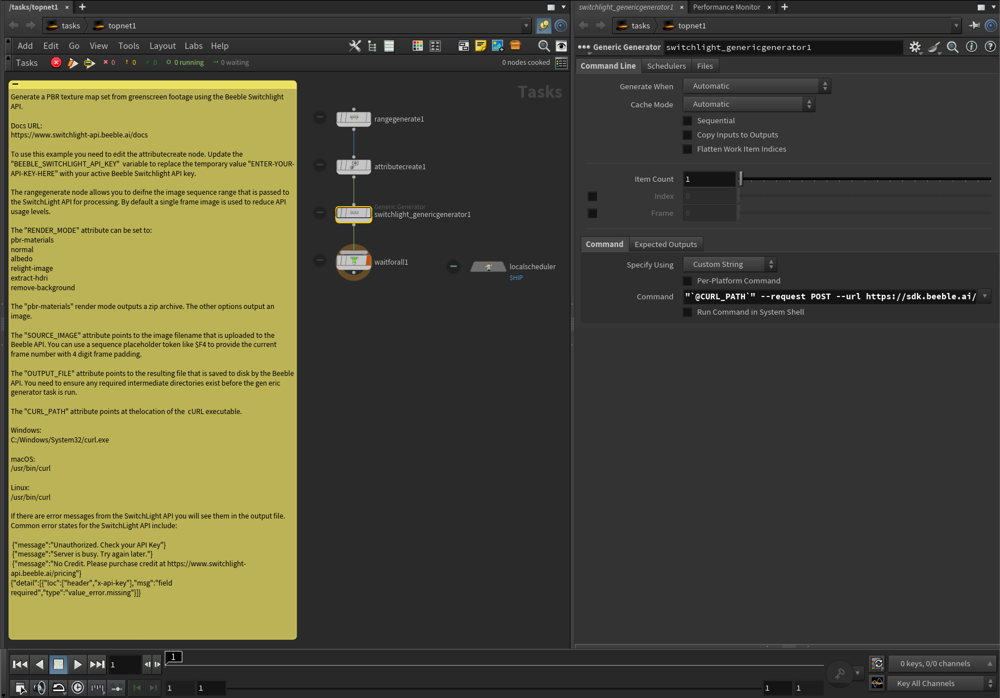

# Beeble SwitchLight API

The [Beeble Switchlight API](https://www.switchlight-api.beeble.ai/docs) allows for PBR material relighting of live action shot footage.

## Examples

An example .hip file is provided help you get started with Postshot workflows in Houdini:

### /HoudiniProjects/TOPS_BeebleSwitchLight/

- TOPs_BeebleSwitchlight_API_V001.hip

## Screenshots



## Usage

To use this example you need to edit the attributecreate node. Update the "BEEBLE_SWITCHLIGHT_API_KEY"  variable to replace the temporary value "ENTER-YOUR-API-KEY-HERE" with your active Beeble Switchlight API key.

The rangegenerate node allows you to deifne the image sequence range that is passed to the SwitchLight API for processing. By default a single frame image is used to reduce API usage levels.

The "RENDER_MODE" attribute can be set to:

    pbr-materials
    normal
    albedo
    relight-image
    extract-hdri
    remove-background

The "pbr-materials" render mode outputs a zip archive. The other options output an image.

The "SOURCE_IMAGE" attribute points to the image filename that is uploaded to the Beeble API. You can use a sequence placeholder token like $F4 to provide the current frame number with 4 digit frame padding.

The "OUTPUT_FILE" attribute points to the resulting file that is saved to disk by the Beeble API. You need to ensure any required intermediate directories exist before the gen eric generator task is run.

The "CURL_PATH" attribute points at thelocation of the  cURL executable.

Windows:

    C:/Windows/System32/curl.exe

macOS:

    /usr/bin/curl

Linux:

    /usr/bin/curl

If there are error messages from the SwitchLight API you will see them in the output file. Common error states for the SwitchLight API include:

    {"message":"Unauthorized. Check your API Key"}
    {"message":"Server is busy. Try again later."}
    {"message":"No Credit. Please purchase credit at https://www.switchlight-api.beeble.ai/pricing"}
    {"detail":[{"loc":["header","x-api-key"],"msg":"field required","type":"value_error.missing"}]}


### Attribute Create Node:

CURL_PATH: 

    C:/Windows/System32/curl.exe

BEEBLE_SWITCHLIGHT_API_KEY:

    ENTER-YOUR-API-KEY-HERE

RENDER_MODE:

    pbr-materials

SOURCE_IMAGE:

    $HIP/images/$F4/Silver-Mask.png

OUTPUT_FILE:

    $HIP/zip/Silver-Mask.$F4.zip

### Train Generic Generator Node:

```bash
"`@CURL_PATH`" --request POST --url https://sdk.beeble.ai/v1/acquire/`@RENDER_MODE` --header "x-api-key: `@BEEBLE_SWITCHLIGHT_API_KEY`" --form "source_image=@`@SOURCE_IMAGE`" -o "`@OUTPUT_FILE`"
```
