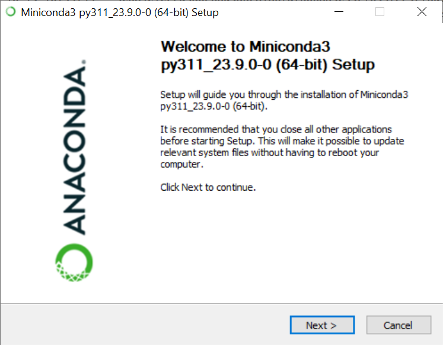
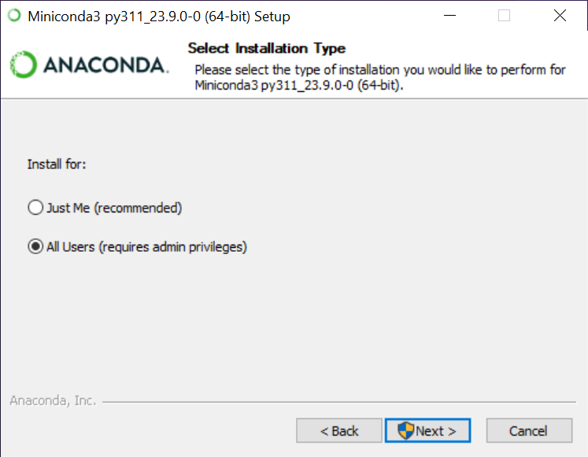
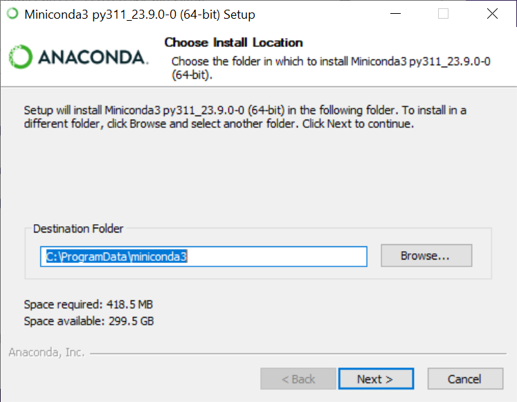
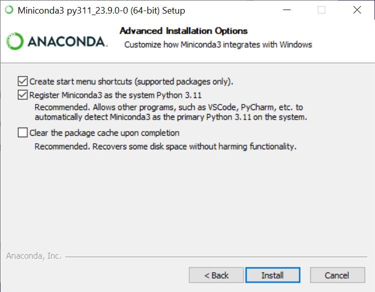
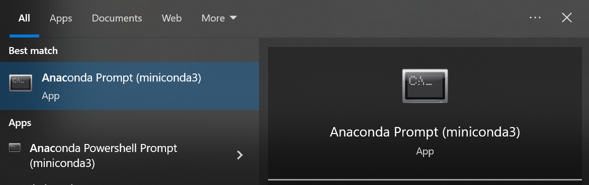
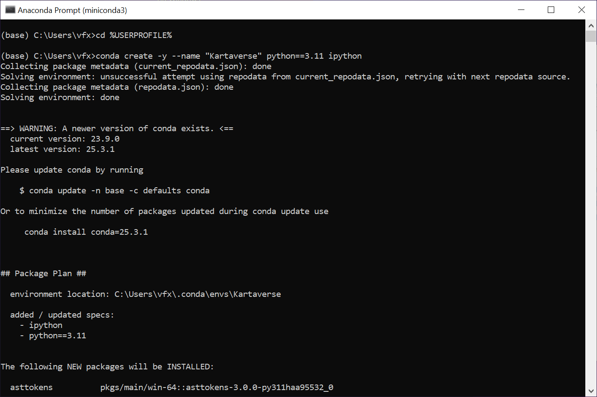
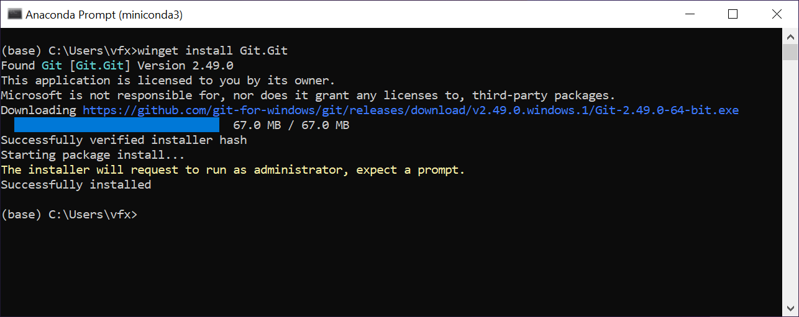
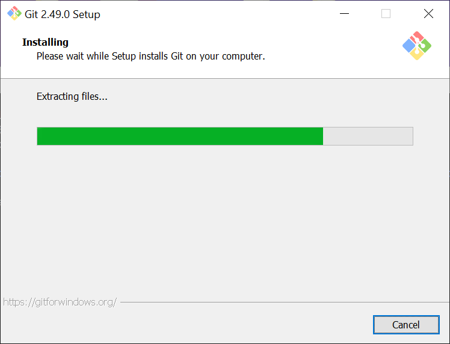
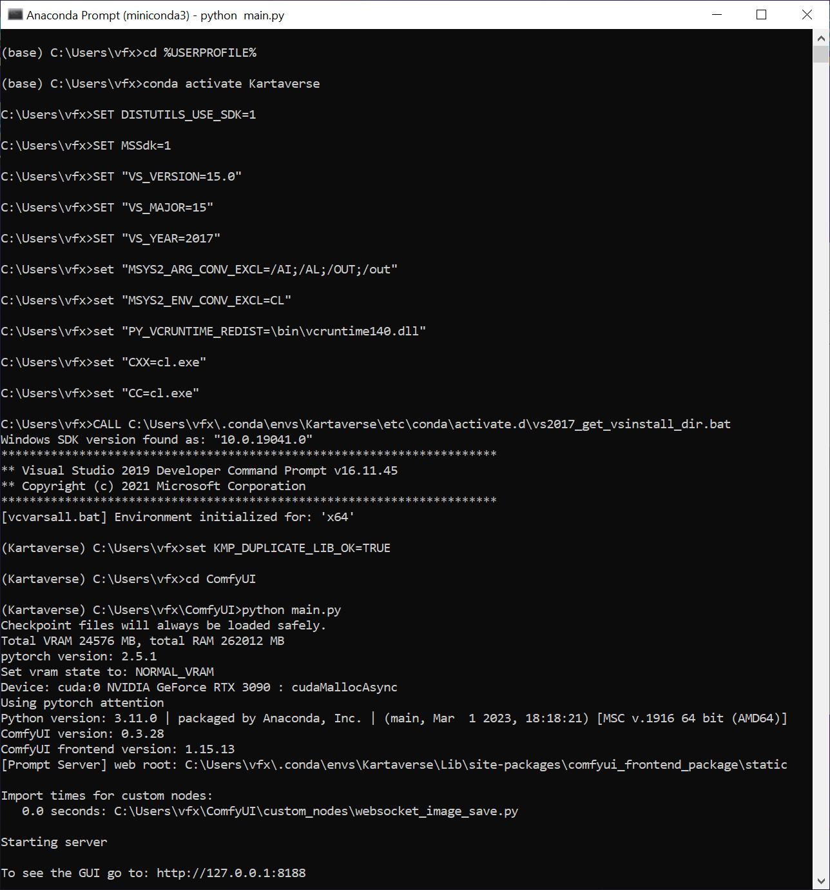
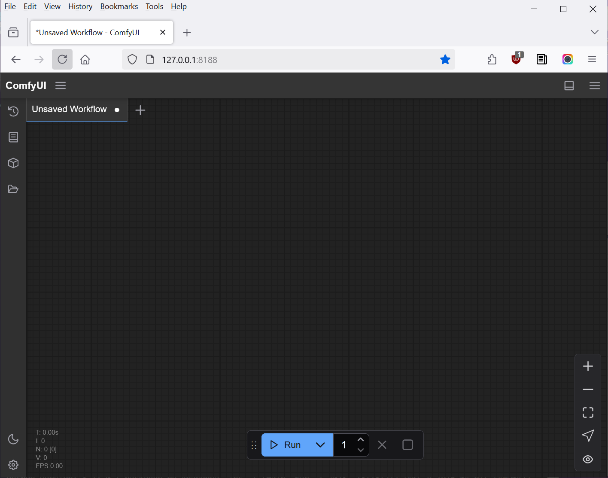

# MatAnyone

Docs by: Andrew Hazelden <andrew@andrewhazelden.com>  
Last Updated: 2025-04-16 03.08 PM  

## Overview

One of the stumbling points for artists new to volumetric video post-production is having an efficient way to isolate individual objects that are visible in your live action multi-view camera array captured footage.

Creating per-character alpha masks, is a great way to refine your video photogrammetry workflows by allowing the camera alignment and scene reconstruction software to focus on the content that matters the most to you.

The [ComfyUI](https://github.com/comfyanonymous/ComfyUI) ML nodegraph is a great place to explore the [MatAnyone](https://github.com/FuouM/ComfyUI-MatAnyone) automated segmentation mask creation toolset. MatAnyone provides temporally stable matte creation that can be used to create alpha channels to separate individual elements in a video frame or still photo. 
## Install Miniconda

Start by downloading [Miniconda for Python 3.11](https://repo.anaconda.com/miniconda/Miniconda3-py311_23.9.0-0-Windows-x86_64.exe
)
	
Follow the standard installation process:

There is a [Conda usage guide](https://docs.conda.io/projects/conda/en/latest/user-guide/getting-started.html) if you need tips.
	

## Optional Step: Install Visual Studio 2019 with the C++ development addons.

If you want to have access to VFX pipeline tools like OpenImageIO / OIIOTOOL then it is helpful to have Visual Studio Installed.

	https://aka.ms/vs/16/release/vs_community.exe

OpenImageIO installation on Windows is covered in separate workflows guides.

## Start Anaconda Prompt (miniconda3)

Open the start menu and launch the shortcut for the terminal program called "Anaconda Prompt (miniconda3)".

## Create the conda virtual environment

Enter the following commands into the Anaconda Prompt window:

	cd %USERPROFILE%
	conda create -y --name "Kartaverse" python==3.11 ipython
	conda activate Kartaverse

## Add the core tools

Then add the core libraries used for NVIDIA GPU based ML workflows:

	cd %USERPROFILE%
	conda activate Kartaverse
	conda install conda-forge::cuda-python
	conda install nvidia/label/cuda-12.8.1::cuda-toolkit
	conda install pytorch torchvision torchaudio pytorch-cuda=12.1 -c pytorch -c nvidia
	conda install cupy

	python -m pip install --upgrade pip
	pip install rich
	pip install hydra-core --upgrade
	pip install torch
	pip install numpy --upgrade

## Add git to the system

Start by installing the Microsoft [winget-cli package manager](https://apps.microsoft.com/detail/9nblggh4nns1?hl=en-US&gl=CA).

Then use winget-cli to install git for Windows:

	winget install Git.Git

## Add ComfyUI to the conda virtual environment:

Note: The official docs for [ComfyUI](https://docs.comfy.org/installation/manual_install) are handy if you need extra guidance.

To add ComfyUI to your system, type the following commands into the Anaconda Prompt window:

	cd %USERPROFILE%
	conda activate Kartaverse
	git clone https://github.com/comfyanonymous/ComfyUI.git
	cd ComfyUI
	pip install -r requirements.txt

## Launch ComfyUI for the first time

To launch the ComfyUI web-gui, type the following commands into the Anaconda Prompt window:

	cd %USERPROFILE%
	conda activate Kartaverse
	set KMP_DUPLICATE_LIB_OK=TRUE
	cd ComfyUI
	python main.py

You can start using ComfyUI by open a new ComfyUI session up in a web browser:

	explorer http://127.0.0.1:8188

## Add the MatAnyone ComfyUI Addon

The MatAnyone addon is handy if you want to create automated segmentation masks for your multi-view camera array imagery.

The following webpages have useful resources for MatAnyone usage:

	https://github.com/FuouM/ComfyUI-MatAnyone
	https://github.com/pq-yang/MatAnyone?tab=readme-ov-file#download-model
	https://docs.comfy.org/essentials/core-concepts/models

Wh have the option of using the ComfyUI Manager to streamline model installs. If you want to do the process manually:

Download [matanyone.pth](https://github.com/pq-yang/MatAnyone/releases/download/v1.0.0/matanyone.pth) (138 MB) file.
	
Move the downloaded "matanyone.pth" model file to:

	%USERPROFILE%\ComfyUI\models\checkpoints\matanyone.pth

You can download the extra example content in the MatAnyone repo using:

	cd %USERPROFILE%
	conda activate Kartaverse
	git clone https://github.com/FuouM/ComfyUI-MatAnyone.git
	cd ComfyUI-MatAnyone
	pip install -r requirements.txt

You might want to start your MatAnyone learning journey with the project file:

	workflow/workflow_mat_anyone.json

## Troubleshooting

	conda install git

When installing Git using conda I had a disk permissions error:
  environment location: C:\ProgramData\miniconda3

I attempted to right-click on the folder using Explorer and in the properties window I unchecked "[x]Read only". This still didn't solve things.

Then I switched over to using winget to install git for Windows. And it worked well.

## ComfuyUI and OpenMP

When starting ComfyUI:

	python main.py

I received the following error about [OpenMP](https://en.wikipedia.org/wiki/OpenMP) shared memory multiprocesing library.

	OMP: Error #15: Initializing libiomp5md.dll, but found libiomp5md.dll already initialized.
	OMP: Hint This means that multiple copies of the OpenMP runtime have been linked into the program. That is dangerous, since it can degrade performance or cause incorrect results. The best thing to do is to ensure that only a single OpenMP runtime is linked into the process, e.g. by avoiding static linking of the OpenMP runtime in any library. As an unsafe, unsupported, undocumented workaround you can set the environment variable KMP_DUPLICATE_LIB_OK=TRUE to allow the program to continue to execute, but that may cause crashes or silently produce incorrect results. For more information, please see http://www.intel.com/software/products/support/.

Try 1. I checked [Stack Overflow](https://stackoverflow.com/questions/64209238/error-15-initializing-libiomp5md-dll-but-found-libiomp5md-dll-already-initial
) and tried their suggestion which didn't solve the issue:

	This is possibly solved with pip install numpy --upgrade

Try 2. This I did the suggested workaround of setting a new environment variable before starting comfyUI. (This is a stop-gap solution that at least lets you continue working.)

	set KMP_DUPLICATE_LIB_OK=TRUE
