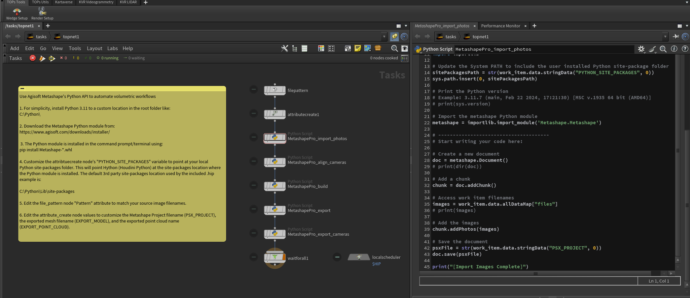
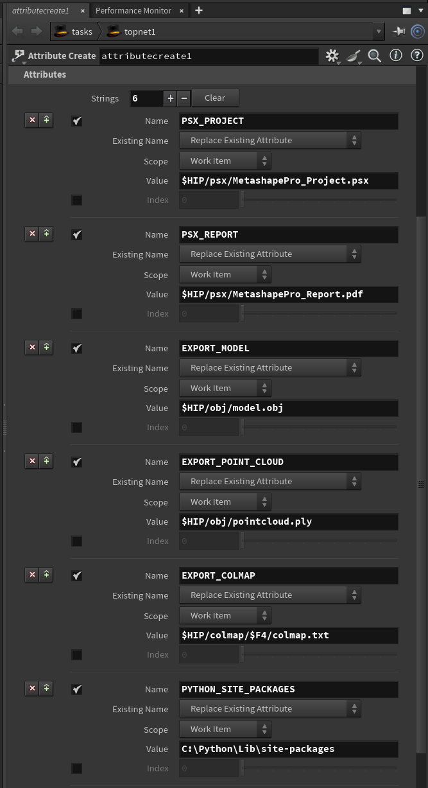

# Metashape Pro Python Workflows

The Agisoft [Metashape Pro](https://www.agisoft.com/features/professional-edition/) software supports Python scripting through the use of a Metashape [Python module](https://www.agisoft.com/pdf/metashape_python_api_2_2_1.pdf). This allows for efficient Houdini TOPs based automation of 3DGS workflow tasks. 

There is a handy GitHub repository of [sample Metashape code](https://github.com/agisoft-llc/metashape-scripts/blob/master/src/samples/general_workflow.py) that is a great reference/learning resource when used alongside the Metashape Python API docs.

Note: It is possible to use a Metashape camera pose export with Postshot CLI for 3DGS training.

## Examples

Example .hip files are provided to help you get started with Metashape Pro workflows in Houdini:

### /HoudiniProjects/TOPS_MetashapePro/

- TOPs_FFmpeg_Movies_to_Frameset_Images_V001.hip
- TOPs_Frameset_Images_to_Image_Sequence_V001.hip
- TOPs_MetashapePro_Print_Methods_V001.hip
- TOPs_MetashapePro_RunJob_V001.hip

To make full use of the "TOPs_MetashapePro_RunJob_V001.hip" Houdini .hip file, you should add a "psx" folder to your Houdini project folder hierarchy. This is used to store the newly created Metashape .psx project files, and the report PDFs.

## Screenshots

Metashape Pro can be used for automated 3D reconstructions:



The "attribute create" node is used to customize the job parameters. These values are passed to Metashape's Python API via the "pythonscript" node.



## Using Agisoft Metashape's Python API to automate volumetric workflows

1. For simplicity, install Python 3.11 to a custom location in the root folder like:

```bash
C:\Python\
```

2. Download the [Metashape Python module](https://www.agisoft.com/downloads/installer/).

3. The Metashape Python Module is installed in the command prompt/terminal using:

 ```bash
pip install Metashape-*.whl
```

You can see a report of where the Metashape site-package is installed using the command prompt/terminal window using:

 ```bash
pip list
pip show Metashape

```

Result:

    Location: C:\python\Lib\site-packages


4. Update the Houdini TOPS based "pythonscript" node. We need to add some Python code to the textfield to modify the "sys.path.insert()" entry. This will point Hython (Houdini Python) at the site-packages location where the Metashape Python module is installed. The default 3rd party site-packages location used by the included .hip example is:

```bash
C:\Python\Lib\site-packages
```

5. Edit the file_pattern node "Pattern" attribute to match your source image filenames.

6. Edit the attribute_create node values to customize the Metashape Project filename (PSX_PROJECT), the exported mesh filename (EXPORT_MODEL), and the exported point cloud name (EXPORT_POINT_CLOUD).

## TOPs Based Pythonscript Code Snippets

The Houdini TOPs nodegraph supports the direct execution of Python code snippets with the [Pythonscript node](https://www.sidefx.com/docs/houdini/nodes/top/pythonscript.html). This relies on the Hython (Houdini Python) interpreter matching the version specifics of the Metashape Python module.

### MetashapePro_import_photos.py

```python
# 1. For simplicity, install Python 3.11 to a custom location in the root folder like:
# C:\Python\

# 2. Download the Metashape Python Module from:
# https://www.agisoft.com/downloads/installer/

# 3. The Python Module is installed in the command prompt/terminal using:
# pip install Metashape-*.whl

import sys, os
import importlib

# Update the System PATH to include the Metashape based site-package folder
sys.path.insert(0, "C:\Python\Lib\site-packages")

# Print the Python version
# Example: 3.11.7 (main, Feb 22 2024, 17:21:30) [MSC v.1935 64 bit (AMD64)]
# print(sys.version)

# Import the metashape Python module
metashape = importlib.import_module('Metashape.Metashape')

# --------------------------------------
# Start writing your code here:

# Create a new document
doc = metashape.Document()
# print(dir(doc))

# Add a chunk
chunk = doc.addChunk()

# Access work item filenames
images = work_item.data.allDataMap["files"]
# print(images)

# Add the images
chunk.addPhotos(images)

# Save the document
psxFile = str(work_item.data.stringData("PSX_PROJECT", 0))
doc.save(psxFile)

print("[Import Images Complete]")

```

### MetashapePro_align_cameras.py

```python
# 1. For simplicity, install Python 3.11 to a custom location in the root folder like:
# C:\Python\

# 2. Download the Metashape Python Module from:
# https://www.agisoft.com/downloads/installer/

# 3. The Python Module is installed in the command prompt/terminal using:
# pip install Metashape-*.whl

import sys, os
import importlib

# Update the System PATH to include the Metashape based site-package folder
sys.path.insert(0, "C:\Python\Lib\site-packages")

# Print the Python version
# Example: 3.11.7 (main, Feb 22 2024, 17:21:30) [MSC v.1935 64 bit (AMD64)]
# print(sys.version)

# Import the metashape Python module
metashape = importlib.import_module('Metashape.Metashape')

# --------------------------------------
# Start writing your code here:

# Metashape Project Filename
psxFile = str(work_item.data.stringData("PSX_PROJECT", 0))

# Open an existing document
doc = metashape.Document()
doc.open(psxFile)

# Get the chunk
chunk = doc.chunk

# Align the views
chunk.matchPhotos()
chunk.alignCameras()

# Save the document
doc.save()

print("[Align Cameras Complete]")

```

### MetashapePro_build.py

```python
# 1. For simplicity, install Python 3.11 to a custom location in the root folder like:
# C:\Python\

# 2. Download the Metashape Python Module from:
# https://www.agisoft.com/downloads/installer/

# 3. The Python Module is installed in the command prompt/terminal using:
# pip install Metashape-*.whl

import sys, os
import importlib

# Update the System PATH to include the Metashape based site-package folder
sys.path.insert(0, "C:\Python\Lib\site-packages")

# Print the Python version
# Example: 3.11.7 (main, Feb 22 2024, 17:21:30) [MSC v.1935 64 bit (AMD64)]
# print(sys.version)

# Import the metashape Python module
metashape = importlib.import_module('Metashape.Metashape')

# --------------------------------------
# Start writing your code here:

# Metashape Project Filename
psxFile = str(work_item.data.stringData("PSX_PROJECT", 0))

# Open an existing document
doc = metashape.Document()
doc.open(psxFile)

# Get the chunk
chunk = doc.chunk

# Depthmap Creation
chunk.buildDepthMaps(downscale = 2, filter_mode = metashape.MildFiltering)

# Save the document
doc.save()

# PointCloud Creation
chunk.buildPointCloud()

# Save the document
doc.save()

# Geometry Creation
chunk.buildModel(source_data = metashape.DepthMapsData)

# Save the document
doc.save()

# UV Layout Creation
chunk.buildUV(page_count = 2, texture_size = 4096)

# Save the document
doc.save()

# Texture Map Creation
chunk.buildTexture(texture_size = 4096, ghosting_filter = True)

# Save the document
doc.save()

print("[Build Complete]")

```

### MetashapePro_export.py

```python
# 1. For simplicity, install Python 3.11 to a custom location in the root folder like:
# C:\Python\

# 2. Download the Metashape Python Module from:
# https://www.agisoft.com/downloads/installer/

# 3. The Python Module is installed in the command prompt/terminal using:
# pip install Metashape-*.whl

import sys, os
import importlib

# Update the System PATH to include the Metashape based site-package folder
sys.path.insert(0, "C:\Python\Lib\site-packages")

# Print the Python version
# Example: 3.11.7 (main, Feb 22 2024, 17:21:30) [MSC v.1935 64 bit (AMD64)]
# print(sys.version)

# Import the metashape Python module
metashape = importlib.import_module('Metashape.Metashape')

# --------------------------------------
# Start writing your code here:

# Metashape Project Filename
psxFile = str(work_item.data.stringData("PSX_PROJECT", 0))

# Open an existing document
doc = metashape.Document()
doc.open(psxFile)

# Get the chunk
chunk = doc.chunk

# Export Results
pdfFile = str(work_item.data.stringData("PSX_REPORT", 0))
chunk.exportReport(pdfFile)

# Export Model
if chunk.model:
    modelFile = str(work_item.data.stringData("EXPORT_MODEL", 0))
    chunk.exportModel(modelFile)
 
# Export the Dense Point Cloud
if chunk.point_cloud:
    cloudFile = str(work_item.data.stringData("EXPORT_POINT_CLOUD", 0))
    chunk.exportPointCloud(cloudFile)

# Save the document
doc.save()

print("[Export Complete]")

```

