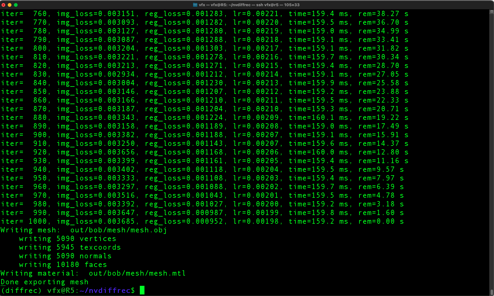
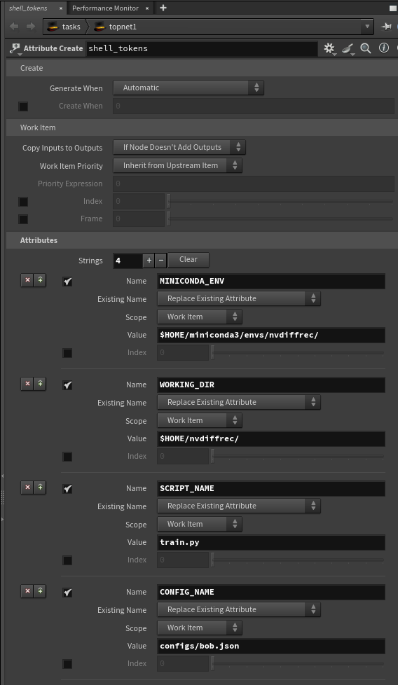

# Kartaverse Workflows | nvdiffrec on Linux

NVIDIA has released the source code for the [nvdiffrec](https://github.com/NVlabs/nvdiffrec) library for Linux. This is connected to the paper "[Extracting Triangular 3D Models, Materials, and Lighting From Images](https://nvlabs.github.io/nvdiffrec/)". The nvdiffrec source code is covered by the non-commercial [NVIDIA Source Code License](https://github.com/NVlabs/nvdiffrec/blob/main/LICENSE.txt).

## Setup the Conda environment on MintOS Linux

The following commands can be entered in a new terminal session to install Conda and create a new virtual environment named "nvdiffrec":

	sudo apt-get update
	sudo apt install git
	
	cd $HOME
	wget --no-check-certificate https://repo.anaconda.com/miniconda/Miniconda3-py39_4.12.0-Linux-x86_64.sh
	chmod -v +x Miniconda*.sh
	./Miniconda3-py39_4.12.0-Linux-x86_64.sh
	
	conda create -y --name "nvdiffrec" python==3.11 ipython

Next we are going to activate the virtual environment and install the required libraries:

	conda activate nvdiffrec
	conda install conda-forge::cuda-python conda-forge::tiny-cuda-nn
	conda update -n base -c defaults conda
	
	sudo apt install nvidia-cuda-toolkit nvidia-cuda-toolkit-gcc
	
	pip install "numpy<2.0" "opencv-python<4.12.0" "setuptools <72.1.0" "slangtorch==1.3.4" scikit-learn plyfile torchmetrics rich imageio pygltflib usd-core
	pip install torch torchvision torchaudio rich
	pip install cupy ninja imageio PyOpenGL glfw xatlas gdown imageio imageio-freeimage

Then we download the nvdiffrast and nvdiffrec repos:

	pip install git+https://github.com/NVlabs/nvdiffrast/
	
	git clone --recursive https://github.com/NVlabs/nvdiffrec

We can validate NVIDIA CudaToolkit is working from the terminal session by running the CUDA compiler program:

	nvcc --version

If CudaToolkit is installed and works you should see a terminal result like:

	nvcc: NVIDIA (R) Cuda compiler driver
	Copyright (c) 2005-2019 NVIDIA Corporation
	Built on Sun_Jul_28_19:07:16_PDT_2019
	Cuda compilation tools, release 10.1, V10.1.243

## Train a scene

Let's activate the nvdiffrec virtual environment, and navigate into the nvdiffrec folder to start a training run using the sample data:

	conda activate nvdiffrec
	cd $HOME/nvdiffrec/
	python train.py --config configs/bob.json

If you want to see an interactive preview as the training runs we can add an extra CLI flag:

	conda activate nvdiffrec
	cd $HOME/nvdiffrec/
	python train.py --config configs/bob.json --display-interval 10

When the training job starts it lists the base configuration values used:

	Config / Flags:
	---------
	config configs/bob.json
	iter 1000
	batch 4
	spp 1
	layers 1
	train_res [512, 512]
	display_res [512, 512]
	texture_res [1024, 1024]
	display_interval 0
	save_interval 100
	learning_rate [0.03, 0.003]
	min_roughness 0.08
	custom_mip False
	random_textures True
	background white
	loss logl1
	out_dir out/bob
	ref_mesh data/bob/bob_tri.obj
	base_mesh None
	validate False
	isosurface dmtet
	mtl_override None
	dmtet_grid 64
	mesh_scale 2.1
	env_scale 2.0
	envmap data/irrmaps/aerodynamics_workshop_2k.hdr
	display None
	camera_space_light False
	lock_light False
	lock_pos False
	sdf_regularizer 0.2
	laplace relative
	laplace_scale 10000.0
	pre_load True
	kd_min [0.0, 0.0, 0.0, 0.0]
	kd_max [1.0, 1.0, 1.0, 1.0]
	ks_min [0, 0.25, 0]
	ks_max [1.0, 1.0, 1.0]
	nrm_min [-1.0, -1.0, 0.0]
	nrm_max [1.0, 1.0, 1.0]
	cam_near_far [0.1, 1000.0]
	learn_light True
	local_rank 0
	multi_gpu False
	---------
	DatasetMesh: ref mesh has 10688 triangles and 5344 vertices

Then progress information will be displayed as the task runs:

	iter=  260, img_loss=0.007175, reg_loss=0.015584, lr=0.02660, time=247.0 ms, rem=3.05 m
	iter=  270, img_loss=0.007357, reg_loss=0.015605, lr=0.02648, time=246.0 ms, rem=2.99 m
	iter=  280, img_loss=0.006650, reg_loss=0.015656, lr=0.02636, time=246.2 ms, rem=2.95 m
	iter=  290, img_loss=0.006408, reg_loss=0.015655, lr=0.02624, time=247.1 ms, rem=2.92 m
	iter=  300, img_loss=0.006616, reg_loss=0.015655, lr=0.02612, time=246.4 ms, rem=2.87 m

When the job completes successfully you should see a terminal message that looks like:

	Writing mesh:
	out/bob/mesh/mesh.obj
	writing 5090 vertices
	writing 5945 texcoords
	writing 5090 normals
	writing 10180 faces
	Writing material: out/bob/mesh/mesh.mtl
	Done exporting mesh
	(diffrec) -/nvdiffrec$

When you run training jobs, the source media is typically stored in:

	$HOME/nvdiffrec/data/

The training results are saved inside the "out" folder, in a newly created project specific sub-folder:

	$HOME/nvdiffrec/out/<job name>/

This output folder will have content named like:

- dmtet_mesh/mesh.mtl
- dmtet_mesh/mesh.obj
- dmtet_mesh/probe.hdr
- dmtet_mesh/texture_kd.png
- dmtet_mesh/texture_ks.png
- dmtet_mesh/texture_n.png
- img_dmtet_pass1_[000000-000010].png
- img_dmtet_pass_[000000-000010].png
- mesh/mesh.mtl
- mesh/mesh.obj
- mesh/probe.hdr
- mesh/texture_kd.png
- mesh/texture_ks.png
- mesh/texture_n.png

## Examples

Sample NeRD datasets:

	https://github.com/vork/moldGoldCape
	https://github.com/vork/ethiopianHead

If you download sample datasets from the web, install that content into sub-folders located inside the nvdiffrec data folder:

	$HOME/nvdiffrec/data/

## Troubleshooting

## Numpy Version

If you have an incompatible version of Numpy installed you will see an error like this:

	Traceback (most recent call last):
		File "/home/vfx/nvdiffrec/train.py", line 605, in <module>
			geometry, mat = optimize_mesh(glctx, geometry, mat, lgt, dataset_train, dataset_validate, 
											^^^^^^^^^^^^^^^^^^^^^^^^^^^^^^^^^^^^^^^^^^^^^^^^^^^^^^^^^^^^^^^^^^^^^^^^^
		File "/home/vfx/nvdiffrec/train.py", line 401, in optimize_mesh
			np_result_image = result_image.detach().cpu().numpy()
												^^^^^^^^^^^^^^^^^^^^^^^^^^^^^^^^^^^
	RuntimeError: Numpy is not available

You can try solving this issue using:

	pip uninstall numpy
	pip install "numpy<2.0"

## PyTorch CUDA

If you attempt to use the nvdiffrec train.py script with the "--display-interval" CLI flag, you will see the following error message when PyTorch is used without CUDA support:

	Traceback (most recent call last):
		File "/home/vfx/nvdiffrec/train.py", line 36, in <module>
			from render import mlptexture
		File "/home/vfx/nvdiffrec/render/mlptexture.py", line 11, in <module>
			import tinycudann as tcnn
		File "/home/vfx/miniconda3/envs/nvdiffrec/lib/python3.11/site-packages/tinycudann/__init__.py", line 9, in <module>
			from tinycudann.modules import free_temporary_memory, NetworkWithInputEncoding, Network, Encoding
		File "/home/vfx/miniconda3/envs/nvdiffrec/lib/python3.11/site-packages/tinycudann/modules.py", line 19, in <module>
			raise EnvironmentError("Unknown compute capability. Ensure PyTorch with CUDA support is installed.")
	OSError: Unknown compute capability. Ensure PyTorch with CUDA support is installed.

You can verify the installed copy of PyTorch has CUDA support by running:

	python -c "import torch; print(torch.__version__, torch.cuda.is_available())"

If CUDA support is functional the terminal result will look like:

	2.8.0+cu128 True

### Lock Files

If you accidentally run two sessions of nvdiffrec at the same time you might get into a situation where a lock file is created. If run the nvdiffrec train.py script again, and get a lock error message in the terminal window, you can clear the lock file using:

	rm -rf "$HOME/.cache/torch_extensions/py311_cu118/nvdiffrast_plugin_gl/lock"

(The filepath is reported in the error message in the terminal and will be specific to your Python version and CudaToolkit version

Then you can re-run the training task:

	python train.py --config configs/bob.json

## Houdini TOPs (Task Operator) Workflows

Lets add nodal workflow automation to the nvdiffrec efforts. We are going to do this with help of SideFX [Houdini TOPs](https://www.sidefx.com/docs/houdini/tops/index.html) (task operators) nodes.

This approach makes it possible to create modular, reusable, node-graphs that control NVIDIA's nvdiffrec library using the command-line. The end goal is to create a fully templated system that can train a single static scene. The same nodes can be expanded to create a flexible pipeline that can be run locally or in the cloud.

### Examples

An example .hip file is provided to help you get started with nvdiffrec workflows in Houdini:

#### /HoudiniProjects/TOPS_nvdiffrec/

- TOPs_nvdiffrec_Static_V001.hip

This HIP file requires you to have launched Houdini/HQueue from inside a virtual environment session that has CUDA Toolkit, Python 3.11, and several other python packages pre-installed.

If you are using Miniconda, a new terminal session can be started up using:

    conda activate nvdiffrec
    cd $HOME/nvdiffrec/
    houdini

### Parameter Customization

#### Attribute Create:

"MINICONDA_ENV" is the folder pathwhere your active Anaconda Miniconda virtual environment exists at. This is typically a location inside your user accounts home folder like "$HOME/miniconda3/envs/nvdiffrec/".

"WORKING_DIR" is the folder path where the nvdiffrec Github repo contents are located. Typically this is a folder like "$HOME/nvdiffrec/".

"SCRIPT_NAME" is the "train.py" script filename.

"CONFIG_NAME" is a relative JSON filepath. It specifies a .json file that exists in a folder like "$HOME/nvdiffrec/configs". This folder has presets that are optimized for the nerd and nerf sample datasets.

#### Environment Edit:

The EnvironmentEdit node is used to customize the PYTHONHOME and PYTHONPATH environment variables. This helps redefine the Python version and site-packages used by nvdiffrec so it is compatible with a virtual environment like Conda or Miniconda.

The "CUDA_HOME" environment variable is set to match the path that is used by the Conda virtual environment's "$CONDA_PREFIX". On a typical Linux Conda setup the "CUDA_HOME"  path is expanded to the absolute filepath version of "$HOME/miniconda3/envs/nvdiffrec".

    CUDA_HOME = `@MINICONDA_ENV`
    PYTHONHOME = `@MINICONDA_ENV`
    PYTHONPATH = `@MINICONDA_ENV`/lib/python3.11/site-packages

#### Generic Generator:

The GenericGenerator node runs the command-line job task. The custom variables we defined in the Attribute Create nodde are referenced when building out the command-line flags that are passed to Python3 and the train.py script:

    "`@MINICONDA_ENV`bin/python3" "`@WORKING_DIR``@SCRIPT_NAME`" --config "`@WORKING_DIR``@CONFIG_NAME`"

### Running your first TOPs job

Click on the orange colored triangle button in the Tasks toolbar to start cooking the Houdini TOPs work items. This will start the batch rendering job. 

The results of the opcook operation can be seen in the node graph, and in the "Task Graph Table" panel. Click on the solid green circle inside the GenericGenerator node shape to view this work item's Task info.

At this point, you can double-click on the Task Graph Table's "train_genericgenerator1" entry to display the cooking status in more detail.

As your GPU fans spin up under the compute load from the nvidiffrec training task, you will see the pages of progress messages scroll by in the status window. The rendering process will take a while so please be patient!

When the training job is done you can close the status window. Take a moment to look at the TOPs node graph. If everything succeeded you should see green circles with checkmarks next to each of the nodes:

You've now used Houdini TOPs to process your first nvidiffrec dataset!
