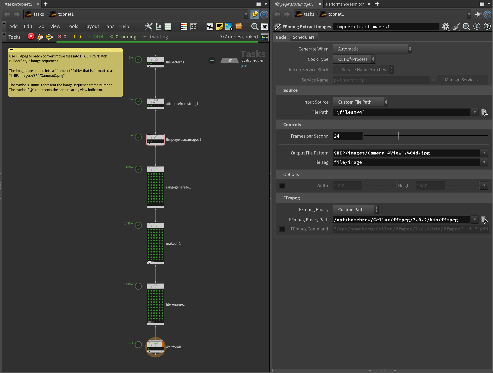
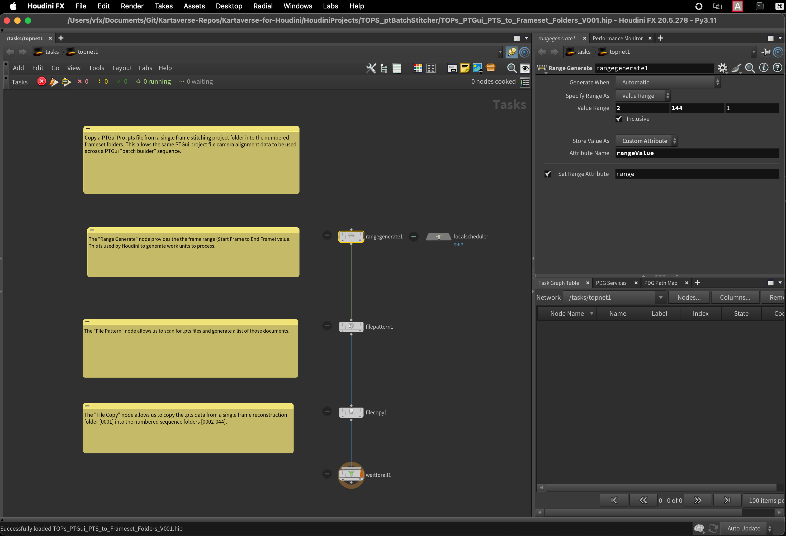
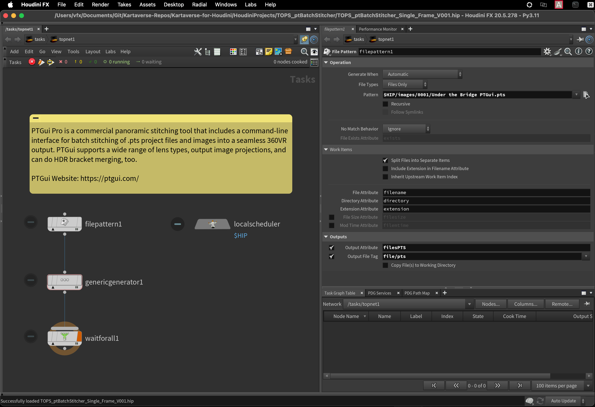

# Panotools Workflows

> The Kartaverse "PT" examples allow you to access PTGui Pro v11-12 based .pts (JSON) 360VR stitching project files in Houdini using parametric node-based operators.

This TOPs based toolset is a companion project to the existing Kartaverse for Fusion ["PT" data nodes project](https://kartaverse.github.io/PT-Data-Nodes-Docs/).

The letters "PT" stand for Pano Tools. The Houdini TOPs example .hip files make it easy to parametrically extract values from a .pts file. Changes made in the PTGui project file are automatically reflected in your Houdini node graph.

## Examples

A collection of example .hip files are provided help you get started with PTGui .pts workflows in Houdini:

### /HoudiniProjects/TOPS_Panotools/
- TOPs_PTS_to_Frameset_Folders_V001.hip
- TOPs_FFmpeg_Movies_to_Frameset_Images_V001.hip
- TOPs_PTS_Batch_Stitcher_Frameset_Folders_V001.hip
- TOPs_PTS_Batch_Stitcher_Single_Frame_V001.hip

## Screenshots

FFmpeg can be used to transcode video files into PTGui "BatchBuilder" folder hierarchy based image sequences.

* * *

Houdini TOPs can be used to create PTGui "BatchBuilder" folder hierarchies. This is a key step if you want to use image sequence based stitching.

* * *

Batch Stitching of PTGui Pro .pts files is possible using Houdini TOPs and the PTGui Pro command-line interface.

* * *