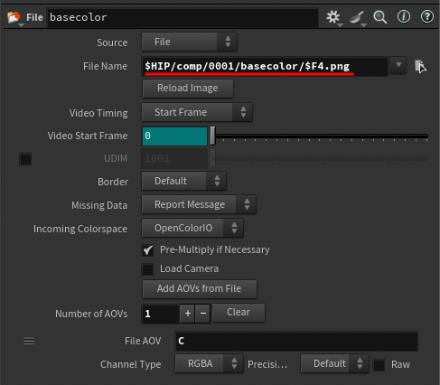

# Kartaverse Workflows | PBR-GS Workflows

## Overview

This guide shows how Houdini can be used as key tool in next-generation volumetric video workflows. Houdini's Copernicus (COPs) node graph is an excellent tool for pre-processing multi-view camera array data so it can be used with interactive relighting techniques in post-production.

## What's up with PBR-GS?

3D/4D Gaussian Splatting is a popular way to render 3D scanned assets. What makes splatting interesting to visual effects artists is the way live-action scanned assets can have view-dependent shading effects. These visual properties can be used to represent surface materials with reflective, transparent, and refractive details.

One issue at the moment is the way that 3DGS models typically have lighting effects baked into the final trained model. The pre-existing lighting information can make it challenging to change the scene illumination in post-production such as doing a day-for-night shot.

With a bit of extra work, it is possible to mix 3DGS workflows, with traditional 3D rendering pipelines that involve PBR (Physically Based Rendering) surface material properties. This gives us the best of both worlds, where you can achieve a high degree of art direct-ability as you craft your final image.

Kartaverse uses the term "PBR-GS" for a specific type of hybrid gaussian splatting workflow. It uses spherical harmonics for the base view-dependent shading effects, then blends in point-sample aligned PBR material attributes that provide true volumetric relighting. PBR-GS is an approach that can help VFX artists integrate volumetric video footage into a larger digital environment.

When using PBR-GS concepts in production, a 3D DCC package can perform full volumetric relighting of 3D scanned 3DGS/4DGS assets. You can even bake the results of illumination changes and modified HDRI environmental reflections, back to disk as 3DGS/4DGS .ply files that can be used by existing "traditional" gaussian splatting tools.

Inside of DCC apps like Houdini or Unreal, the  volumetric relighting results can be rendered as "AOV" render pass elements that can also be sent as multi-layer EXRs to a compositing package. In Comp it is possible to apply further grading and image relighting operations which allows the CG rendered elements to integrated with live-action backplates. This enables productions to flexibly support the use of 4DGS assets inside of traditional VFX workflows like live-action scene integration, camera tracking/match moving, and digital matte painting.

You can read more about the proposed PBR-GS extension to the gaussian splatting .ply file format here:  
[https://github.com/Kartaverse/PBR-GS](https://github.com/Kartaverse/PBR-GS)

## COPs Examples

Example .hip files are provided to help you get started with PBR-GS workflows in Houdini:

### /HoudiniProjects/COPS_PBR_to_COLMAP

- COPS_Beeble_to_COLMAP_Masking_v001.hip
- COPS_PBR_PreviewMaterial_v001.hip

## COPS Beeble to COLMAP Masking

This COPs network helps prepare live action footage for use in relighting workflows. It applies an alpha mask to each of the PBR textures output by Beeble Switchlight. Additionally, the specular and roughness greyscale images are converted into RGBA texture maps which makes photogrammetry and 3DGS training programs happy.

This is what the COPS network looks like:

The PBR pass texture maps are imported into COPS using "file" nodes:

The source media is read with "file" nodes from the following file paths:

- $HIP/comp/$F4/basecolor/0000.png
- $HIP/comp/$F4/specular/0000.png
- $HIP/comp/$F4/roughness/0000.png
- $HIP/comp/$F4/normal/0000.png

After the images are modified, a "rop_image" node saves the footage:

The processed media is written back to a per-camera view COLMAP file hierarchy using "rop_image" node based output file paths:

- $HIP/colmap/basecolor/images/000001_$F1.png
- $HIP/colmap/specular/images/000001_$F1.png
- $HIP/colmap/roughness/images/000001_$F1.png
- $HIP/colmap/normal/images/000001_$F1.png

With a multi-view camera array that has 204 cameras, the "colmap" project folders are structured like this:

basecolor PBR pass:

- $HIP/colmap/basecolor/images/000001_[0-204].png
- $HIP/colmap/basecolor/sparse/0/cameras.txt
- $HIP/colmap/basecolor/sparse/0/images.txt
- $HIP/colmap/basecolor/sparse/0/points3D.txt

specular PBR pass:

- $HIP/colmap/specular/images/000001_[0-204].png
- $HIP/colmap/specular/sparse/0/cameras.txt
- $HIP/colmap/specular/sparse/0/images.txt
- $HIP/colmap/specular/sparse/0/points3D.txt

roughness PBR pass:

- $HIP/colmap/roughness/images/000001_[0-204].png
- $HIP/colmap/roughness/sparse/0/cameras.txt
- $HIP/colmap/roughness/sparse/0/images.txt
- $HIP/colmap/roughness/sparse/0/points3D.txt

normal PBR pass:

- $HIP/colmap/normal/images/000001_[0-204].png
- $HIP/colmap/normal/sparse/0/cameras.txt
- $HIP/colmap/normal/sparse/0/images.txt
- $HIP/colmap/normal/sparse/0/points3D.txt

These colmap folders are then run through a volumetric video/4DGS training process. This would typically involve the use of photogrammetry and gaussian splatting tools like: COLMAP, Agisoft Metashape Pro, RealityScan, Postshot, and NVIDIA 3DGRUT.

## COPS PBR PreviewMaterial

With this example .hip file, Beeble Switchlight processed PBR texture maps are loaded into a COPs nodegraph and connected to a previewmaterial node. This allows you to review the consistency and quality of the PBR maps quickly and easily.

The Beeble generated basecolor and normal texture maps are treated as RGB imagery. The specular and roughness maps are loaded as mono greyscale imagery. The alpha mask is connected to the PreviewMaterial node's opacity channel.

The PreviewMaterial node has a geo input connection that allows you to bring in reference geometry. You can also choose from several primitive stand-in mesh procedurals.

The resulting output from the PreviewMaterial node can be passed downstream in the node graph via the geo and material output connections.
