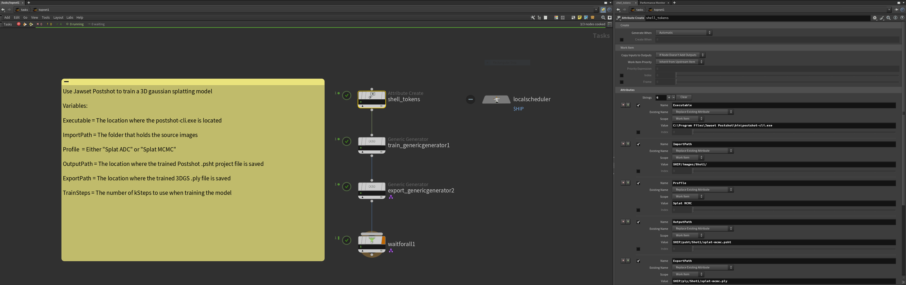
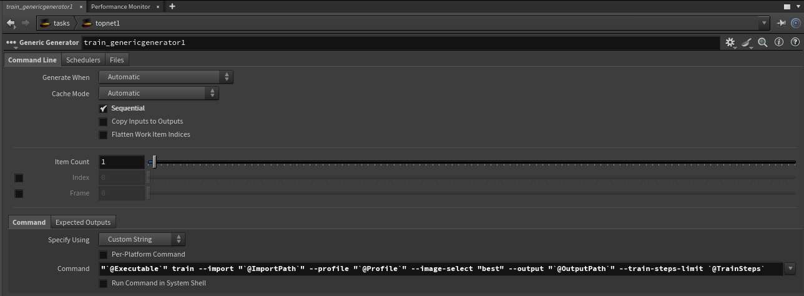
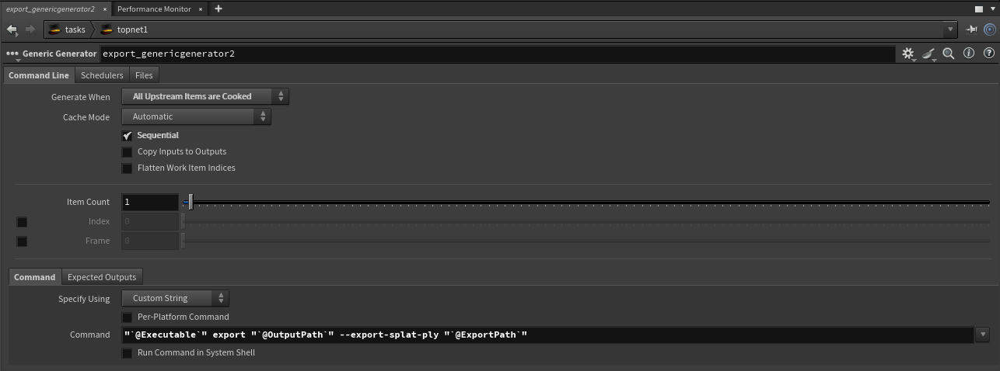

# Postshot Workflows

The [Jawset Postshot](https://www.jawset.com/) software includes a command-line interface. This allows for efficient Houdini TOPs based automation of 3DGS workflow tasks.

You can load the Postshot generated .ply files into the [Houdini GSOPs](https://github.com/david-rhodes/GSOPs) HDA (Gaussian Splatting Operators for SideFX Houdini) for a seamless end-to-end workflow.

Note: Postshot supports the use of camera pose exports from tools like Reality Capture and Metashape.

## Examples

An example .hip file is provided help you get started with Postshot workflows in Houdini:

### /HoudiniProjects/TOPs_Postshot/
- TOPS_Postshot_Static_V001.hip
- TOPS_Postshot_Sequence_V001.hip

To make full use of this Houdini .hip file, you should add a "psht" and a "ply" folder to your Houdini project folder hierarchy. This is used to store the newly created Postshot .psht project files, and the generated 3DGS .ply files.

## Screenshots

Jawset Postshot can be used to train a 3D gaussian model







## Command Line Parameters

Postshot supports the use of a wide range of CLI (command-line) flags. They can be used inside of a Houdini TOPs workflow by adding the extra options you require to the attribute create node, and the generic generator nodes.

Start by reading over the official [Postshot CLI Docs](https://www.jawset.com/docs/d/Postshot+User+Guide/Command-line+Interface).

For Sequence processing, that includes pre-computed colmap camera pose data, the following parameters are a good starting point:

### Attribute Create Node:

Executable: 

    C:\Program Files\Jawset Postshot\bin\postshot-cli.exe

ImportImagePath:

    $HIP/images/$F4/images

ImportColmapPath:

    $HIP/images/$F4/sparse/0

Profile:

    Splat3

OutputPath:

    $HIP/psht/$F4.psht

ExportPath:

    $HIP/ply/$F4.ply

TrainSteps:

    20

### Train Generic Generator Node:

```bash
"`@Executable`" train --import "`@ImportImagePath`" "`@ImportColmapPath`" --profile "`@Profile`" --image-select "best" --output "`@OutputPath`" --train-steps-limit `@TrainSteps`
```

### Export Generic Generator Node:

```bash
"`@Executable`" export --file "`@OutputPath`" --export-splat-ply "`@ExportPath`"
```

### Error Log

The Postshot.log file is saved to:

```bash
%USERPROFILE%\AppData\Local\Postshot\Postshot.log
```

### Postshot CLI Details

Here is a listing of the current Postshop v0.6.0 CLI flags that are available:

```bash
"C:\Program Files\Jawset Postshot\bin\postshot-cli.exe" train --help
Postshot v0.6.0 (2025-04-22)
Start or continue training of a radiance field
Usage: C:\Program Files\Jawset Postshot\bin\postshot-cli.exe train [OPTIONS]

Options:
  -h,--help                   Print this help message and exit
  -i,--import TEXT ... REQUIRED
                              Source file(s) to import for training (images, videos, camera poses, point clouds). Option can be specified multiple times
  --show-train-error          Compute and show the training error
  --gpu INT:INT in [0 - 255]  Specify the index of the GPU to use
  -p,--profile TEXT:{Splat ADC,Splat MCMC,Splat3} [Splat MCMC]
                              The radiance field model profile to train
  --image-select ENUM:{all,best} [all]
                              How to select training images from the source image sets
  --num-train-images INT:POSITIVE
                              If --image-select best is used, specifies the number of training images to select. By default a value will be computed from the total image count.
  --max-image-size INT:NON-NEGATIVE [1600]
                              Downscale training images such that their longer edge is at most this value in pixels. Disabled if zero.
  --max-num-features INT:POSITIVE [8]
                              Maximum number of 2D kFeatures extracted from each image.
  -s,--train-steps-limit INT:POSITIVE
                              Number of kSteps to train the model for. By default a value will be computed from num-train-images.
  --splat-density FLOAT:FLOAT bounded to [0.125 - 8] [1]
                              Controls how much additional splats are generated during training. Applies only in 'Splat ADC' profile.
  --max-num-splats UINT:POSITIVE [3000]
                              Sets the maximum number of splats (in kSplats) created during training. Applies only in 'Splat MCMC' profile.
  --anti-aliasing BOOLEAN     Train with Anti-Aliasing.
  --treat-zero-alpha-as-mask BOOLEAN
                              If input images have a alpha channels, regions with zero alpha will be ignored, not reconstructed as zero alpha.
  --max-sh-degree UINT:UINT in [0 - 3] [3]
                              The maximum degree of Spherical Harmonics coefficients (view-dependent colors) used during training.
[Option Group: Output]

  [At least 1 of the following options are required]
  Options:
    -o,--output TEXT            Store the .psht project file to this path.
    --export-splat-ply TEXT     Export the trained splat model in PLY file format to this path.


"C:\Program Files\Jawset Postshot\bin\postshot-cli.exe" export --help
Postshot v0.6.0 (2025-04-22)
Export data from a .psht project file
Usage: C:\Program Files\Jawset Postshot\bin\postshot-cli.exe export [OPTIONS] file

Positionals:
  file TEXT REQUIRED          Path of .psht project file to export from

Options:
  -h,--help                   Print this help message and exit
  -f,--file TEXT REQUIRED     Path of .psht project file to export from
  --export-splat-ply TEXT REQUIRED
                              Export a splat model in PLY file format to this path.

```

This is an example of what a typical Postshot command-prompt job task would look like if you ran it manually:

    "C:\Program Files\Jawset Postshot\bin\postshot-cli.exe" train --import "C:\Instant-NGP\data\nerf\fox\images" --profile "Splat3" --image-select "best" --output "C:\Instant-NGP\data\nerf\fox\splat-mcmc.psht" -s 5

    "C:\Program Files\Jawset Postshot\bin\postshot-cli.exe" export --file "C:\Instant-NGP\data\nerf\fox\splat.psht" --export-splat-ply "C:\Instant-NGP\data\nerf\fox\splat.ply"
