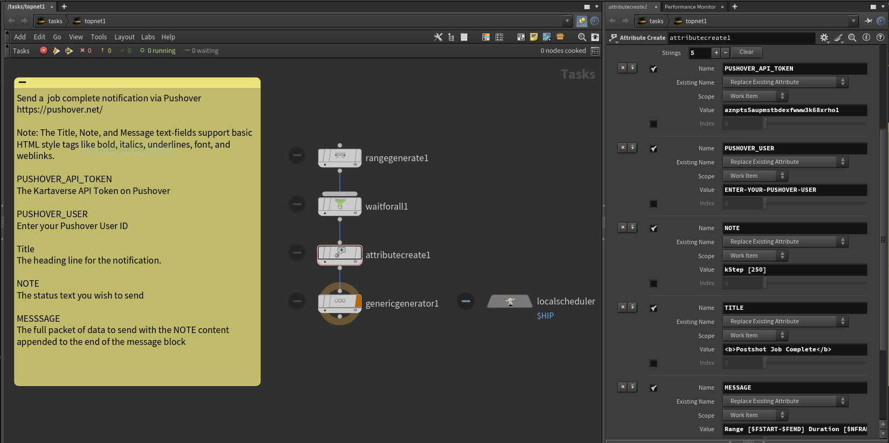

# Using Pushover Notifications with Houdini TOPs

[Pushover](https://pushover.net/) is a mobile friendly notification service. This is a great solution for sending fast and simple notification alerts when a TOPs job completes cooking.

Pushover message content can be sent via a [cURL based web-API](https://pushover.net/api). This means a Houdini TOPs node-graph can send status messages to your Android or iOS mobile device, or to a desktop web browser. 

[HTML formatting](https://pushover.net/api#html) tags can be used in messages to add more style. It is also possible to embedded images in JPG/PNG format to a message using the cURL API. 

## Examples

Example .hip files are provided to help you get started with Pushover's cURL based API. In order to use the provided example .hip file, you will need to enter your Pushover User account ID in the attribute create node.

### /HoudiniProjects/TOPS_PushoverNotifications/

- TOPs_PushoverNotifications_V001.hip

## Screenshots

The "attribute create" node is used to customize the job parameters. The following attributes can be edited:

### PUSHOVER_API_TOKEN

The Kartaverse API Token on Pushover

### PUSHOVER_USER

Enter your Pushover User ID

### Title

The heading line for the notification. 

### NOTE

The status text you wish to send

### MESSSAGE

The full packet of data to send with the NOTE content appended to the end of the message block

