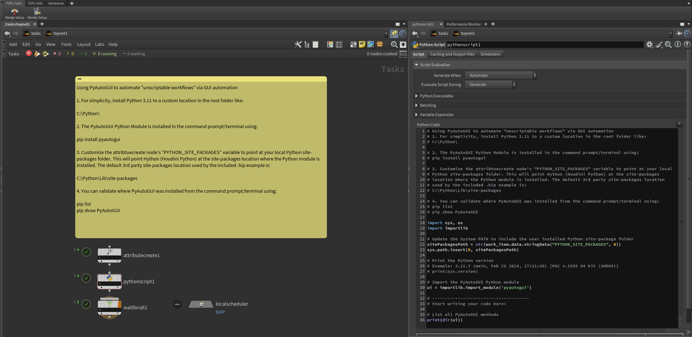
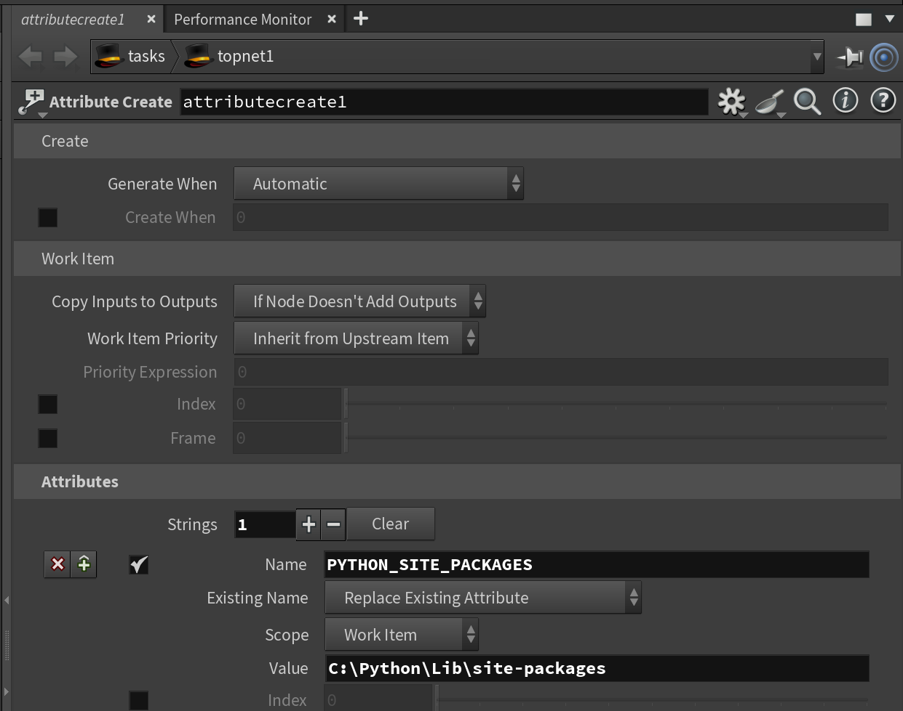
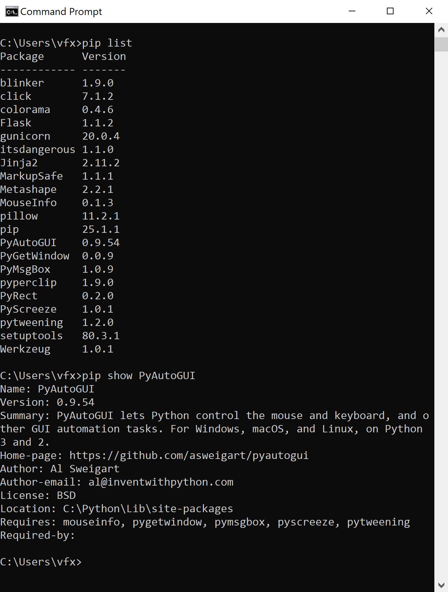
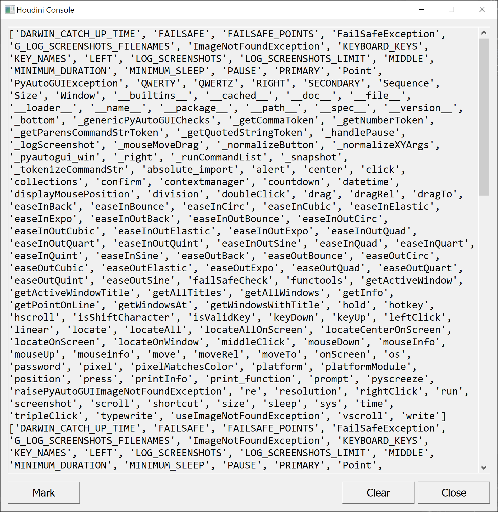

# Using PyAutoGUI with Houdini TOPs

Sometimes you need to run a specialized tool in your pipeline and the program lacks the hooks required to elegantly drive the program via scripting. This might be caused by a required feature being excluded from the scripting API. In many cases the small app you need to use might lack a CLI (command-line interface) or Python module.

In these types of sticky aka "impossible" situations, GUI scripting can come to the rescue. This approach works by simulating the interactions of a human operator through virtual mouse clicks, mouse drags, menu selections, keyboard text typing, button preses, and window moving operations.

GUI automation needs to run in a very consistent environment in order to be stable and reliable. This means a bit of testing is needed to tune the automation parameters if the monitor size, window layout, or GUI program version changes.

If you want a GUI automation tool that runs from Python, the best option is to install the [PyAutoGUI](https://pyautogui.readthedocs.io/en/latest/) Python Module.

If you are looking for an alternative program for GUI automation, tools like [Keyboard Maestro](https://www.keyboardmaestro.com/main/) on macOS, and [AutoHotKey](https://www.autohotkey.com/) on Windows are excellent choices.

## Examples

Example .hip files are provided to help you get started with PyAutoGUI  workflows in Houdini:

### /HoudiniProjects/TOPS_PyAutoGUI/

- TOPS_PyAutoGUI_Demo1_V001.hip

## Screenshots

PyAutoGUI can be used for automating human interactions with apps that lack a scripting interface like CLI flags or a Python module:



The "attribute create" node is used to customize the job parameters. These values are passed to the PyAutoGUI Python API via the "pythonscript" node.



## The Using PyAutoGUI to automate "unscriptable workflows" via GUI automation

1. For simplicity, install Python 3.11 to a custom location in the root folder like:

```bash
C:\Python\
```

2. The PyAutoGUI Python Module is installed in the command prompt/terminal using:

```bash
pip install pyautogui
```

3. Customize the attribtuecreate node's "PYTHON_SITE_PACKAGES" variable to point at your local Python site-packages folder. This will point Hython (Houdini Python) at the site-packages location where the Python module is installed. The default 3rd party site-packages location used by the included .hip example is:

    C:\Python\Lib\site-packages

4. You can validate where PyAutoGUI was installed from the command prompt/terminal using:

 ```bash
pip list
pip show PyAutoGUI
```



## TOPS Based Pythonscript Code Snippets

The Houdini TOPS nodegraph supports the direct execution of Python code snippets with the [Pythonscript node](https://www.sidefx.com/docs/houdini/nodes/top/pythonscript.html). This relies on the Hython (Houdini Python) interpreter matching the version specifics of the Metashape Python module.

### TOPS_PyAutoGUI_Demo1.py

```python
# Using PyAutoGUI to automate "unscriptable workflows" via GUI automation
# 1. For simplicity, install Python 3.11 to a custom location in the root folder like:
# C:\Python\

# 2. The PyAutoGUI Python Module is installed in the command prompt/terminal using:
# pip install pyautogui

# 3. Customize the attribtuecreate node's "PYTHON_SITE_PACKAGES" variable to point at your local
# Python site-packages folder. This will point Hython (Houdini Python) at the site-packages 
# location where the Python module is installed. The default 3rd party site-packages location 
# used by the included .hip example is:
# C:\Python\Lib\site-packages

# 4. You can validate where PyAutoGUI was installed from the command prompt/terminal using:
# pip list
# pip show PyAutoGUI

import sys, os
import importlib

# Update the System PATH to include the user installed Python site-package folder
sitePackagesPath = str(work_item.data.stringData("PYTHON_SITE_PACKAGES", 0))
sys.path.insert(0, sitePackagesPath)

# Print the Python version
# Example: 3.11.7 (main, Feb 22 2024, 17:21:30) [MSC v.1935 64 bit (AMD64)]
# print(sys.version)

# Import the PyAutoGUI Python module
ui = importlib.import_module('pyautogui')

# --------------------------------------
# Start writing your code here:

# List all PyAutoGUI methods
print(dir(ui))

```

