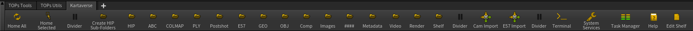

# Shelf Tools

Kartaverse has its own set of custom Houdini shelves. Building the shelves and refining these tools and the icons used is an ongoing WIP R&D process that will evolve further over time, based upon end user feedback. 

The Kartaverse shelf items streamline the most common artist-driven XR post-production workflow steps down to a few single-click actions which you can then modify in a parametric fashion. 

These shelf tools are available on the [Kartaverse for Houdini GitHub project page](https://github.com/Kartaverse/Kartaverse-for-Houdini/tree/master/toolbar) where issues can be reported, and feedback can be collected.

## Screenshots

## Toolbar Installation

Copy the "toolbar" folder contents from the "Kartaverse for Houdini" GitHub repo into the Houdini toolbar folder.

Windows Toolbar Path:

	C:\Users\<Your User Account>\Documents\houdini20.5\toolbar\

macOS Toolbar Path:

	/Users/<Your User Account>/Library/Preferences/houdini/20.5/toolbar/Kartaverse.shelf

## Shelf Items

- Home All
- Home Selected
- Create HIP Sub-Folders
- HIP
- ABC
- COLMAP
- PLY
- Postshot
- E57
- GEO
- OBJ
- Comp
- Images
- \#\#\#\#
- Metadata
- Video
- Render
- Shelf
- Cam Import
- E57 Import
- Terminal
- System Services
- Task Manager
- Help
- Edit Shelf
