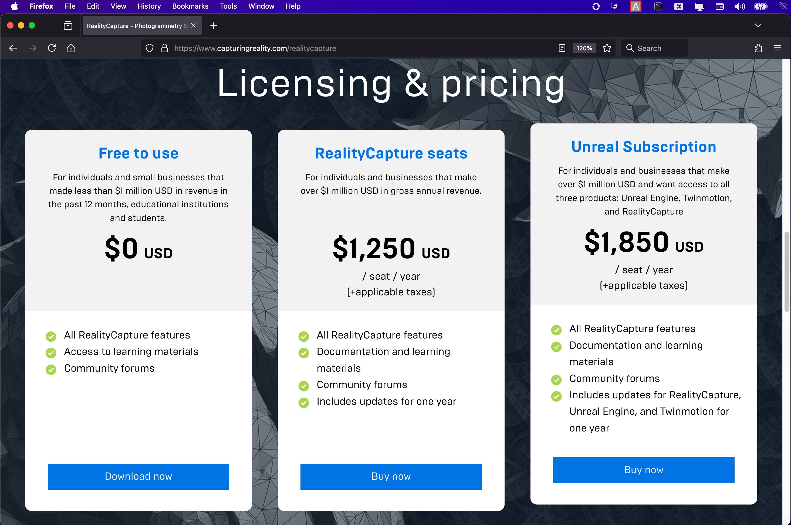
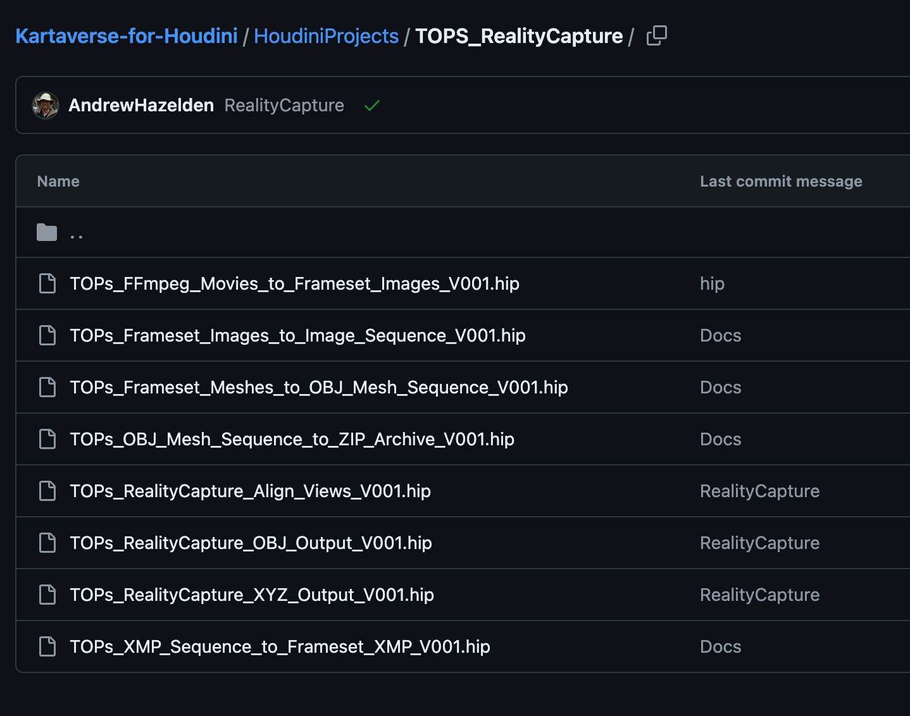

# Volumetric Video Workflows

This Kartaverse workflow guide covers the core details needed to bring SideFX Houdini's "TOPs" node graph onboard for volumetric video workflows.

Houdini's [TOPs](https://www.sidefx.com/docs/houdini/tops/intro.html) (Task Operators) and [PilotPDG](https://www.sidefx.com/products/houdini/pdg/) (Procedural Dependency Graph) features provide artists with a powerful node-based workflow automation toolset. This automation capability exists inside of all versions of SideFX Houdini including: [Apprentice](https://www.sidefx.com/products/houdini-apprentice/) (Free), [Indie](https://www.sidefx.com/products/houdini-indie/) ($269 USD), [Core](https://www.sidefx.com/products/houdini/core-features/) ($1340 USD), [FX](https://www.sidefx.com/products/houdini/fx-features/) ($3195 USD), and [Houdini Engine](https://www.sidefx.com/products/houdini-engine/)/[Batch](https://www.sidefx.com/products/houdini-engine/batch/).

**Houdini Apprentice Pricing Info:**

**Houdini Indie Pricing Info:**

---

The [TOPs](https://www.sidefx.com/docs/houdini/tops/index.html) context in Houdini is especially attractive for XR industry based companies where the immersive sector has highly detailed technical requirements, and clients demand a fast turnaround time for projects. Task operator nodes act like a series of modular building blocks that visually represent a series of individual automation tasks.

You can staff up a new XR project with generalists and tech artists, and not need to depend on retaining on-staff programmers who would otherwise be needed to continuously perform code changes as your project requirements and needs evolve.

This nodal approach is an alternative to creating and maintaining a collection of single-purpose shell scripts ([BASH](https://en.wikipedia.org/wiki/Bash\_(Unix\_shell))/[BAT](https://en.wikipedia.org/wiki/Batch\_file)/[Powershell](https://learn.microsoft.com/en-ca/powershell/)). Tech artists can use nodes to rapidly build out an efficient multi-setup workflow in Houdini. 

Houdini's task operator features support distributed computation when used with Houdini's license free [HQueue](https://www.sidefx.com/docs/houdini/hqueue/overview.html) client/server based render farm software.

By pushing Houdini render jobs to a farm, it allows an artist's workstation to continue to work on new shots, while the rendering jobs happen in the background on a network connected render cluster. This unlocks a massive performance boost when doing volumetric reconstructions, when compared to running jobs only on artist systems.

HQueue can operate as an on-premise or cloud based render farm controller. This can massively speed up compute intensive workflows that involve [Reality Capture](https://www.capturingreality.com/realitycapture) or [Metashape](https://www.agisoft.com/) based videogrammetry data processing.

## Reality Capture Pricing

Reality Capture recently updated its pricing model which makes this high end volumetric 3D scene reconstruction tool far more accessible to individuals, students, freelancers, and small businesses.

The "Free to use" edition of Reality Capture still includes the full command-line automation features. Wow\! Thats a lot of power delivered at an epic price reduction, compared to only a few years ago. 🙌

## Kartaverse for Houdini Example HIPs

To follow along with the learning content in this guide, make sure to download the free open-source [Kartaverse for Houdini example .hip files](https://github.com/Kartaverse/Kartaverse-for-Houdini/tree/master/HoudiniProjects/TOPS\_RealityCapture). 

