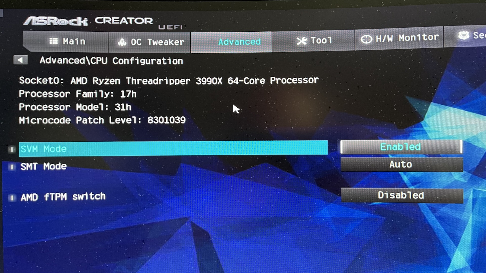
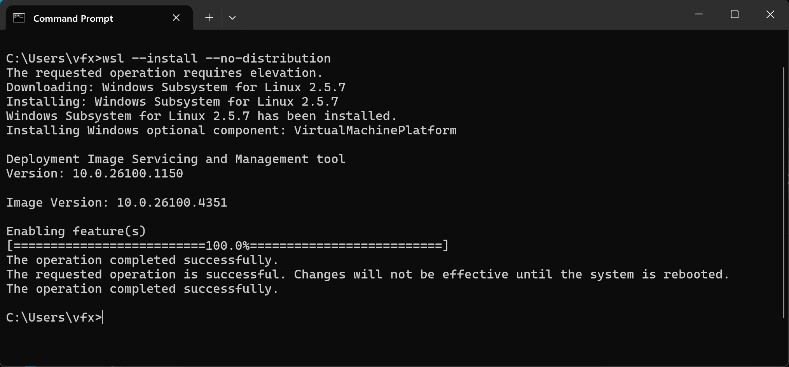
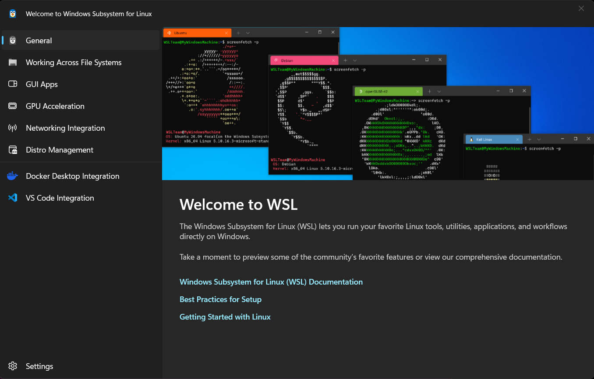
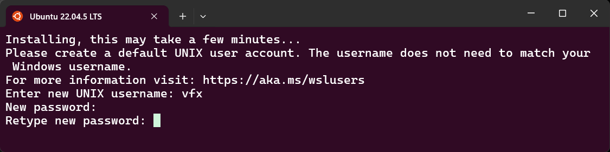
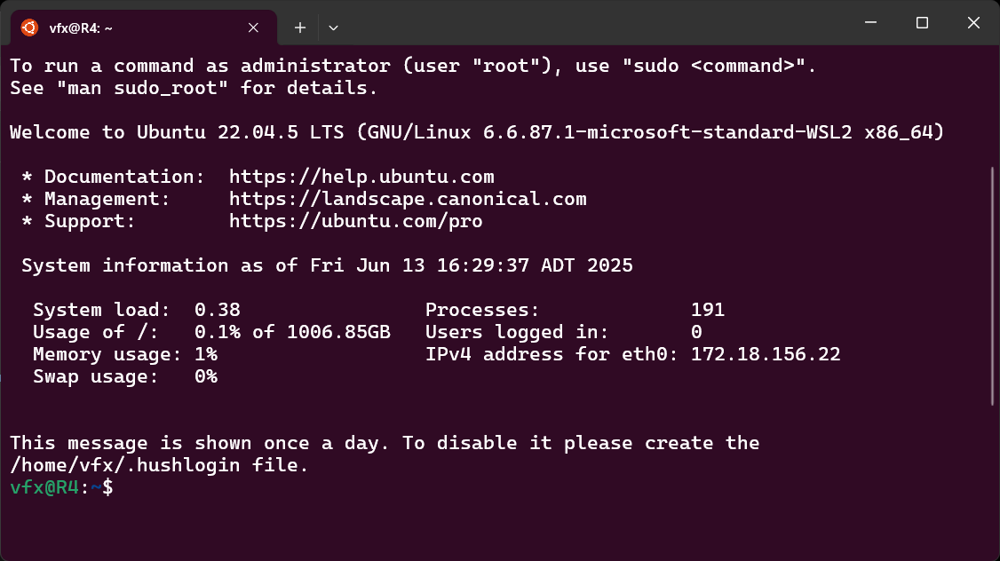

# Windows Subsystem for Linux

[WSL (Windows Subsystem for Linux)](https://learn.microsoft.com/en-us/windows/wsl/install) provides a way to run Linux software on a Windows based PC. 

WSL can be thought of as a Microsoft developed alternative to the [Cygwin](https://cygwin.com/) compatibility layer, or to classic "emulators" like the [VMware Workstation](https://www.vmware.com/products/desktop-hypervisor/workstation-and-fusion) / [Parallels Desktop](https://www.parallels.com/products/desktop/) based virtualization software.

## BIOS

Your motherboard's BIOS settings will probably need to be adjusted to allow WSL to run.

Open the BIOS screen when your computer starts up. This is typically done by pressing the Delete (Del) key as soon as the motherboard branding imagery is visible at startup.

Navigate in the BIOS to the CPU settings. Enable the motherboard "SVM" mode so CPU virtualization is supported. Reboot your PC once for this change to take effect.



## WSL Installation

Lets start by installing WSL without any pre-defined operating systems. Open the [Windows 11 Terminal](https://learn.microsoft.com/en-us/windows/terminal/install) program with admin privileges.

In a Command Prompt session run the code:

```bash
wsl --install --no-distribution
```



Once WSL is installed you will see a splash screen window:



### Adding Ubuntu 22.04

Now lets add the [Ubuntu](https://ubuntu.com/download) operating system to WSL. Currently, Ubuntu 22.04 is a good choice for running most ML tools and NVIDIA 3DGRUT (3D Gaussian Raytracing).

```bash
wsl --install -d Ubuntu-22.04
```

The Terminal shows the following output when installing Ubuntu in WSL:

```bash

Enabling feature(s)
[==========================100.0%==========================]
The operation completed successfully.
The requested operation is successful. Changes will not be effective until the system is rebooted.
wsl: Using legacy distribution registration. Consider using a tar based distribution instead.
Downloading: Ubuntu 22.04 LTS
Ubuntu 22.04 LTS has been downloaded.
Distribution successfully installed. It can be launched via 'wsl.exe -d Ubuntu 22.04 LTS'
Launching Ubuntu 22.04 LTS...
```

### Creating a New User Account

WSL will ask you to create a new user account and to add the password.



Once WSL and Ubuntu 22 are active, you will see the following first run message:



## Miniconda

We are going to install the [Miniconda](https://www.anaconda.com/docs/getting-started/miniconda/main) virtual environment. This will make it easier to add the NVIDIA [CUDA Toolkit](https://developer.nvidia.com/cuda-toolkit) to Ubuntu, and will help us manage [Python](https://www.python.org/downloads/) versions and dependencies.

When running WSL it makes sense to update the [pip](https://pypi.org/project/pip/) package manager, and install [git](https://git-scm.com/downloads), [cmake](https://cmake.org/), the NVIDIA [CUDA Container Toolkit](https://docs.nvidia.com/datacenter/cloud-native/container-toolkit/latest/install-guide.html), and add [Docker](https://www.docker.com/) support to WSL.

